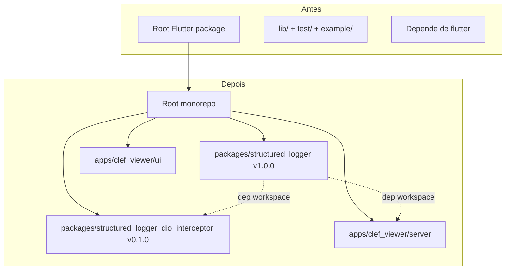
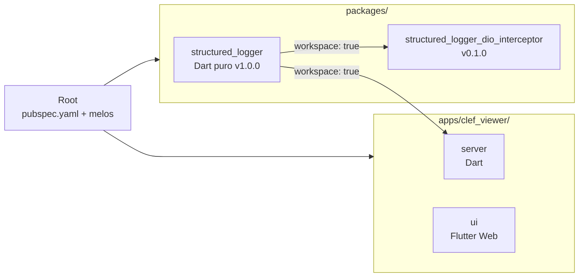
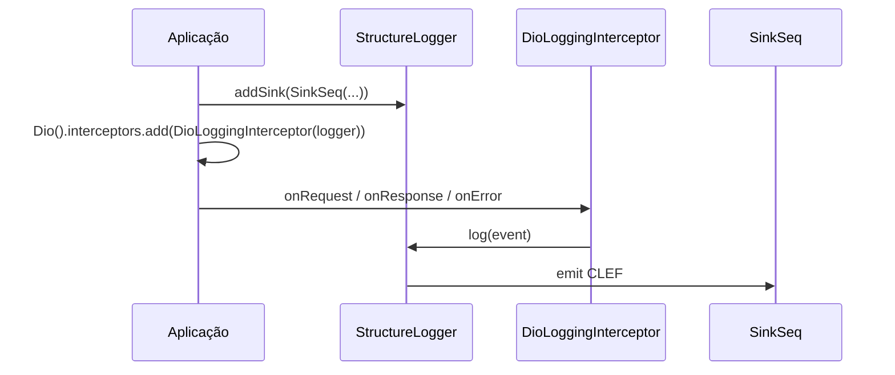
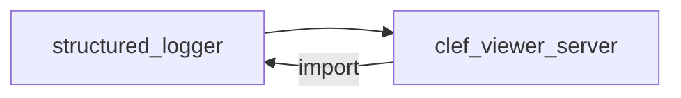
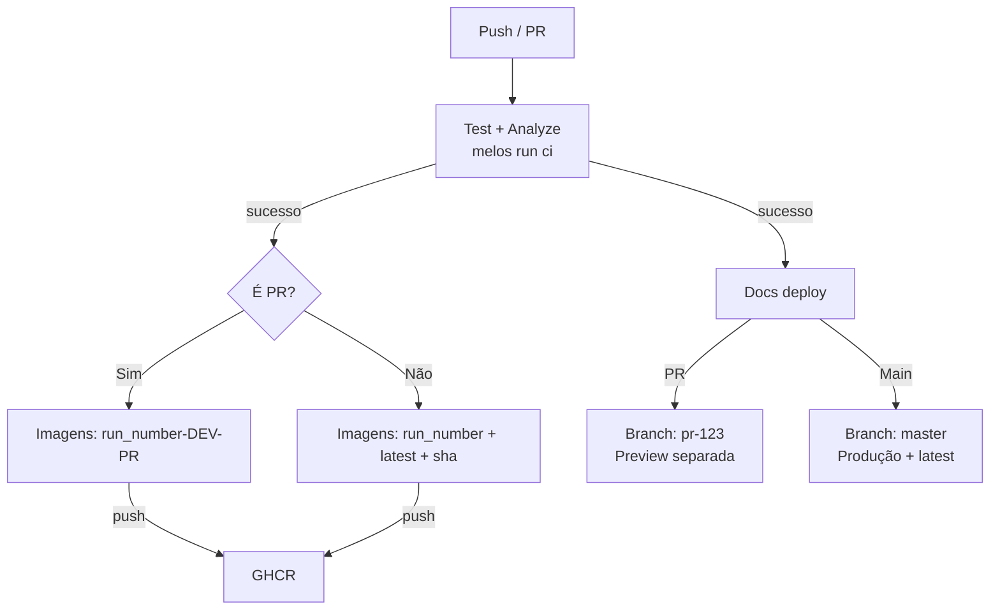

Com o crescimento do ecossistema, decidimos reestruturar o pacote `structured_logger` para suportar melhor o uso em Dart puro (CLI, servidores) sem depender do Flutter.

## Visão geral da reestruturação

O principal objetivo foi separar o **core** do pacote do ecossistema Flutter, permitindo que ele seja usado diretamente em projetos Dart puros.

## O que mudou

### 1. Monorepo com Pub Workspaces + Melos 8

- Raiz agora é **meta-only** (apenas configuração de workspace)
- Pacotes em `packages/`
- Aplicações em `apps/`

### 2. Core agora é Dart-puro (v1.0.0)

- Removida dependência de `flutter`
- SDK mínimo: `^3.6.0`
- `resolution: workspace` em todos os membros
- API pública **100% compatível**

### 3. Novo pacote de integração

### 4. Integração com CLEF Viewer

O server agora depende diretamente do pacote via workspace:

Eliminamos a cópia manual de `seq_constants.dart`.

### 5. CI mais inteligente

## Por que isso importa

- Uso em **Dart puro** sem Flutter SDK
- Manutenção centralizada no monorepo
- Previews automáticas de imagens e docs em PRs
- `latest` sempre reflete a última versão estável da main

## Próximos passos

- Publicação oficial de `structured_logger` 1.0.0
- Publicação do `structured_logger_dio_interceptor`
- Guia completo de migração

---

Obrigado a todos que testaram as versões anteriores. Feedback é bem-vindo!

<!--truncate-->
