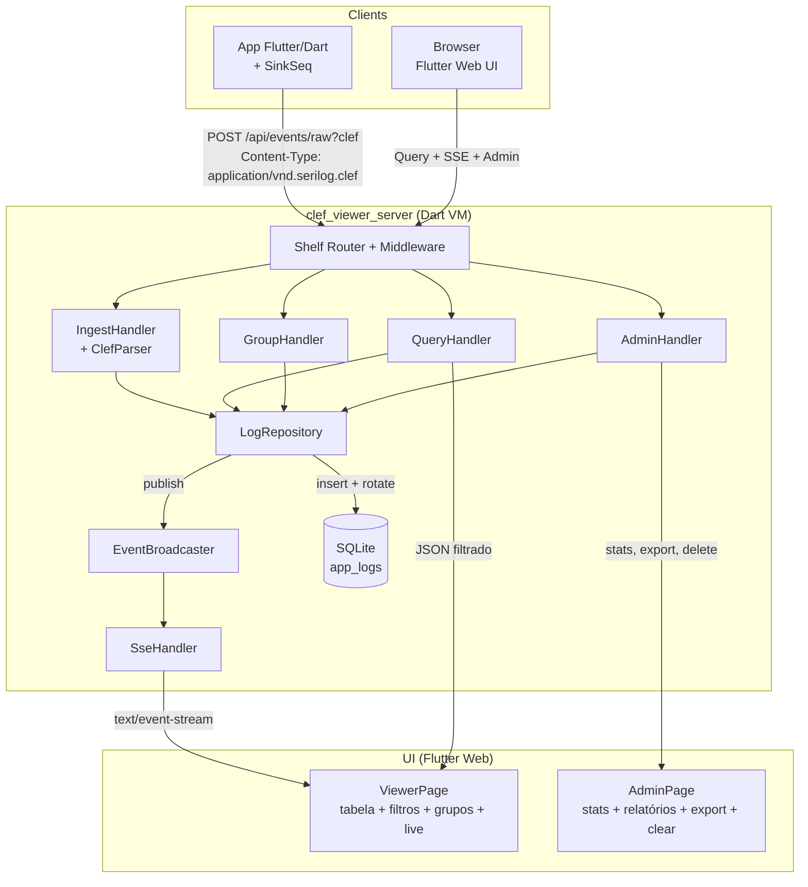
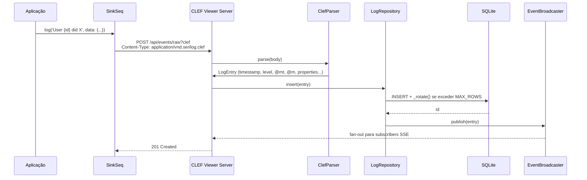
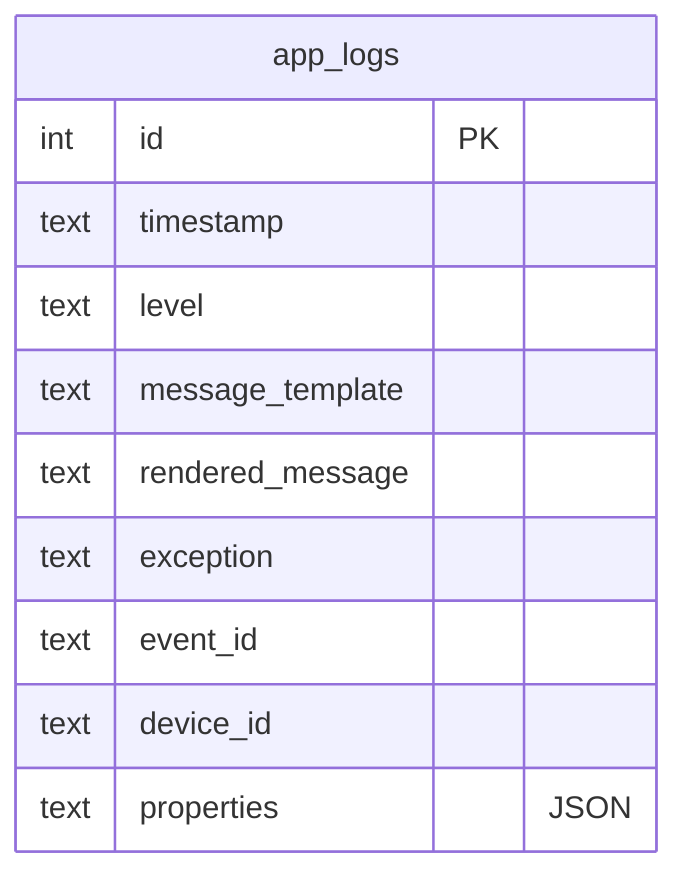
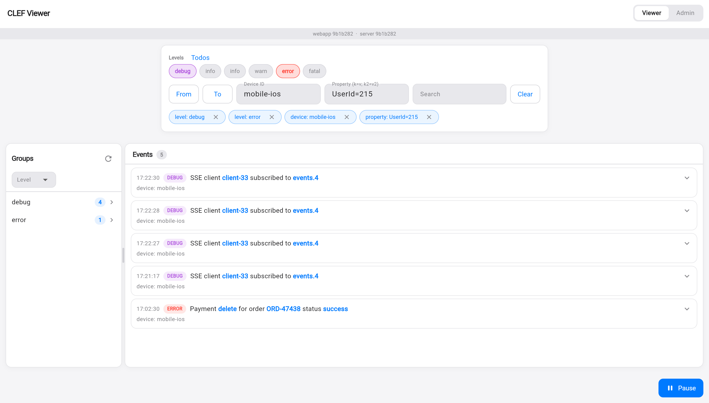
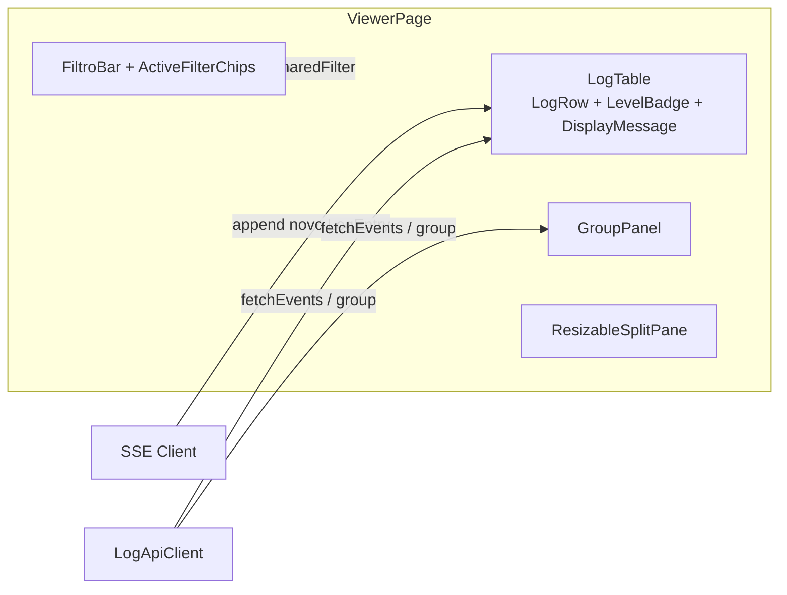
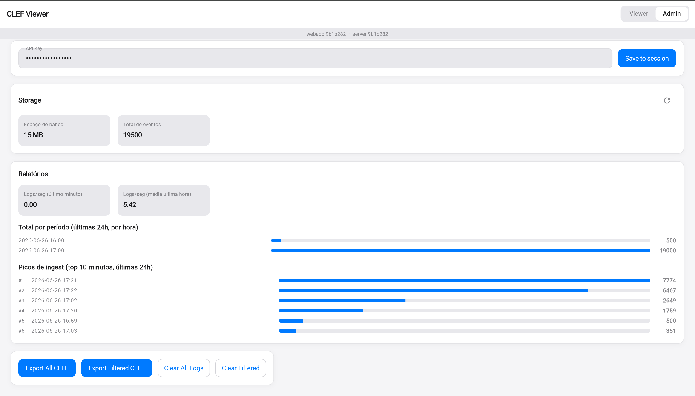
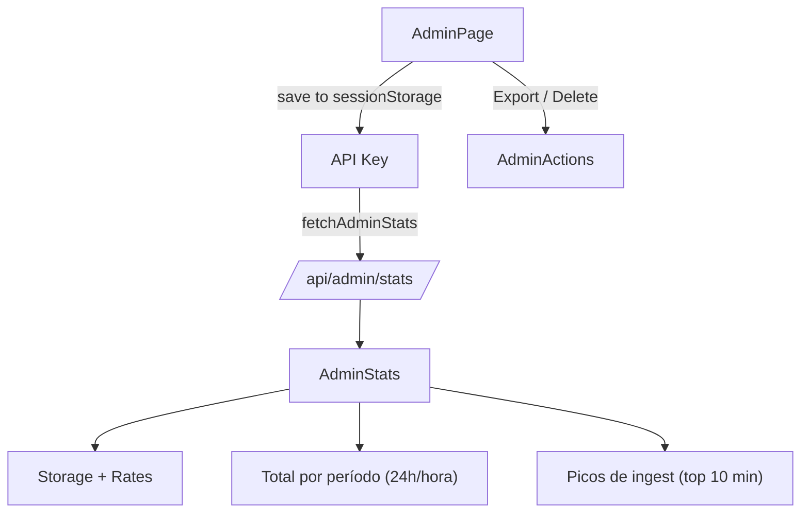
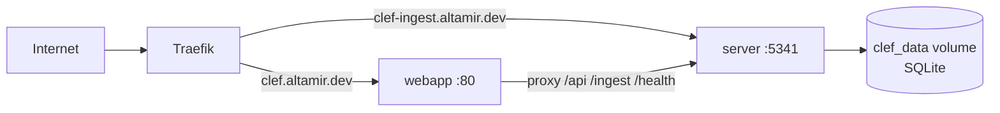

O **CLEF Viewer** é um webapp leve e self-hosted para receber, armazenar e visualizar logs estruturados no formato CLEF (compatível com Seq). Ele foi criado como complemento natural do `structured_logger` para quem precisa de observabilidade em desenvolvimento e pequenos ambientes de produção sem depender de um Seq completo.

<!--truncate-->

## Por que um visualizador CLEF?

Muitos projetos Flutter/Dart usam `print` ou logs soltos. Quando o app cresce, precisamos de:

- Busca e filtros por nível, dispositivo, propriedades
- Visualização em tempo real
- Agrupamentos (por tela, erro, usuário...)
- Export em CLEF para análise posterior ou migração
- Armazenamento com limite (não crescer indefinidamente)

O CLEF Viewer resolve isso de forma simples: um servidor Dart VM + UI Flutter Web, tudo empacotado em duas imagens Docker leves.

Ele usa a **mesma porta padrão do Seq (5341)**, então trocar a URL no `SinkSeq` é suficiente.

## Arquitetura geral



O servidor serve tanto a API quanto os estáticos da UI em produção (via `shelf_static`).

## Fluxo de ingestão de eventos

O `SinkSeq` (e qualquer cliente CLEF) envia eventos para o servidor.



O parser aceita tanto o endpoint Seq clássico (`/api/events/raw?clef`) quanto o moderno (`/ingest/clef` com NDJSON).

## Modelo de armazenamento (SQLite)

Tabela simples e eficiente:



Índices em: `timestamp`, `level`, `device_id`, `event_id`.

**Rotação FIFO**: quando o número de linhas excede `MAX_ROWS` (default 100k), o repositório deleta os mais antigos automaticamente.

Tamanho do banco é exposto na UI Admin via `stat` do arquivo `.db`.

## Visualização em tempo real — Viewer

A aba **Viewer** é onde você passa a maior parte do tempo:

- Tabela de eventos com `LevelBadge`, mensagem renderizada (usa `@m` ou preenche template client-side destacando valores)
- Filtros ricos: nível, período, device id, property filters (com chips ativos editáveis)
- Agrupamento (GroupPanel): por level, hora, device ou qualquer propriedade customizada
- Split pane redimensionável (tabela × grupos)
- **Live updates** via SSE (`/api/events/stream`): novos eventos aparecem automaticamente no topo da tabela (com fallback a polling a cada 3s caso proxy bloqueie SSE)
- Export e ações respeitam o filtro ativo compartilhado entre Viewer e Admin

Aqui está a interface **Viewer** em ação (screenshot real):



**Elementos visíveis no print do Viewer:**

- Header com abas **Viewer** (ativa) | Admin + versões curtas (`webapp 9b1b282 · server 9b1b282`)
- Barra superior de filtros:
  - Pills de **Levels** (Todos + debug selecionado em roxo, error em vermelho, etc.)
  - Campos **From** / **To**
  - **Device ID**: `mobile-ios`
  - **Property** (chave=valor): `UserId=215`
  - Botões Search e Clear
- **Active filter chips** logo abaixo (azuis e removíveis): `level: debug`, `level: error`, `device: mobile-ios`, `property: UserId=215`
- Layout em split:
  - Sidebar esquerda **Groups** (agrupado por Level): debug (4), error (1) com setas
  - Área principal **Events** (contador "5"):
    - Linhas de log com timestamp, badge de nível (roxo para DEBUG, vermelho para ERROR)
    - Mensagem com **destaques em azul** nos valores dinâmicos (ex: `client-33`, `events.4`, `delete`, `success`)
    - Sub-linha `device: mobile-ios`
    - Chevrons para expandir cada evento
- Botão azul **Pause** (canto inferior direito) para pausar o stream em tempo real

Os destaques em azul nas mensagens (ex: `client-33`, `delete`, `success`) são gerados pelo componente `DisplayMessageText`: ele pega o `messageTemplate` do evento e substitui os placeholders pelos valores das `properties`, destacando visualmente cada valor.

Esse print demonstra perfeitamente:
- Filtros compostos (nível + device + propriedade)
- Chips visuais do filtro ativo (ActiveFilterChips)
- Agrupamento lateral atualizado em tempo real (GroupPanel)
- Renderização rica de message template
- Eventos chegando via SSE (vários "SSE client ... subscribed")



## Painel Admin e Relatórios

A aba **Admin** (protegida por `ADMIN_API_KEY` via header `X-Seq-ApiKey`) mostra:

- **Storage**: tamanho do arquivo do banco + total de eventos
- **Relatórios**:
  - Logs/seg (último minuto e média da última hora)
  - Total por período (últimas 24h, agrupado por hora) — barras horizontais
  - Picos de ingest (top 10 minutos nas últimas 24h)
- Ações: Export All CLEF / Export Filtered CLEF (NDJSON compatível), Clear All / Clear Filtered

A chave de API é guardada **apenas no sessionStorage** do navegador (nunca na URL).

Aqui está a interface **Admin** em produção (screenshot real):



**Elementos da tela Admin:**

- Header com abas **Viewer | Admin** (no topo direito) + versões curtas dos builds (`webapp 9b1b282 · server 9b1b282`)
- Campo de **API Key** (valores mascarados) + botão azul **Save to session** (a chave é guardada **somente** em `sessionStorage` do navegador)
- Card **Storage**:
  - "Espaço do banco 15 MB"
  - "Total de eventos 19500"
- Card **Relatórios**:
  - Logs/seg (último minuto): `0.00`
  - Logs/seg (média última hora): `5.42`
- **Total por período (últimas 24h, por hora)** — barras horizontais azuis com horário e contagem (ex.: 2026-06-26 16:00 … 19000)
- **Picos de ingest (top 10 minutos, últimas 24h)** — lista ordenada (#1 2026-06-26 17:21 → 7774, #2 17:22 → 6467 etc.)
- Linha de ações: **Export All CLEF** e **Export Filtered CLEF** (botões azuis primários) + **Clear All Logs** / **Clear Filtered** (secundários)

O filtro ativo compartilhado entre Viewer e Admin faz com que "Export Filtered" e "Clear Filtered" usem exatamente a mesma query que você vê na tabela de logs.

Ambos os screenshots (Viewer e Admin) foram incluídos com base nos prints reais enviados. Os diagramas Mermaid complementam explicando a arquitetura por trás.



Os cálculos são feitos no servidor (`countSince`, `countByHour`, `ingestPeaks`) e enviados como JSON.

## Implantação e Docker

Dois serviços independentes:

| Serviço | Imagem | Porta | Função |
|---------|--------|-------|--------|
| `server` | `ghcr.io/altamir/clef-viewer-server` | 5341 | API + ingest + SSE + SQLite |
| `webapp` | `ghcr.io/altamir/clef-viewer-webapp` | 80 (nginx) | UI Flutter + proxy reverso para /api e /ingest |



Em produção (ex: Hostinger VPS + Docker Manager + Traefik + Let's Encrypt):

- Imagens são publicadas automaticamente pelo CI sempre que há mudança em `apps/clef_viewer/`
- Basta definir `ADMIN_API_KEY`, hosts e fazer deploy do compose

Desenvolvimento local é simples:

```bash
# Server
cd apps/clef_viewer/server
DEV_MODE=true dart run bin/server.dart

# UI (outro terminal)
cd ../ui
flutter run -d chrome --dart-define=CLEF_VIEWER_API=http://localhost:5341
```

Ou use os `docker-compose.*.yml` fornecidos.

## Integração com o structured_logger

Nenhum código extra é necessário no logger:

```dart
import 'package:structured_logger/structured_logger.dart';
import 'dart:io';

final logger = StructureLogger()
  ..addSink(SinkSeq(
    'https://clef-ingest.altamir.dev',
    apiKey: Platform.environment['INGEST_API_KEY'],
    deviceIdentifier: 'meu-app-producao',
  ));

await logger.info('User {userId} viewed {screen}', data: {
  'userId': 42,
  'screen': 'Checkout',
});
```

O evento chega em menos de 1s na UI com SSE.

## Resumo

O CLEF Viewer entrega uma experiência próxima do Seq para casos de uso leves:

- Ingest CLEF nativo (funciona com SinkSeq e outros clientes Serilog-style)
- Realtime + histórico + agrupamentos
- Admin prático com export e limpeza
- Armazenamento limitado e previsível
- Fácil de rodar localmente ou em VPS com Docker
- 100% dentro do monorepo Dart-puro

Ele é a peça que fecha o ciclo: você emite com `structured_logger` → visualiza imediatamente no CLEF Viewer → exporta quando precisar de mais poder.

Experimente:

```bash
git clone https://github.com/Altamir/structured_logger
cd apps/clef_viewer
# siga o README
```

Quer contribuir? Issues e PRs são bem-vindos — especialmente melhorias nos filtros, mais tipos de gráfico e suporte a mais sinks no viewer.

Obrigado a quem já está usando em produção! Feedback é sempre bem-vindo.