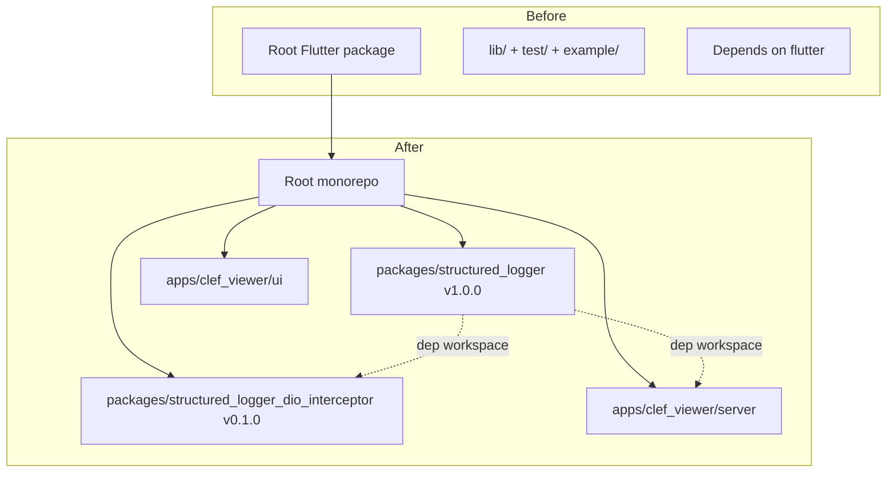
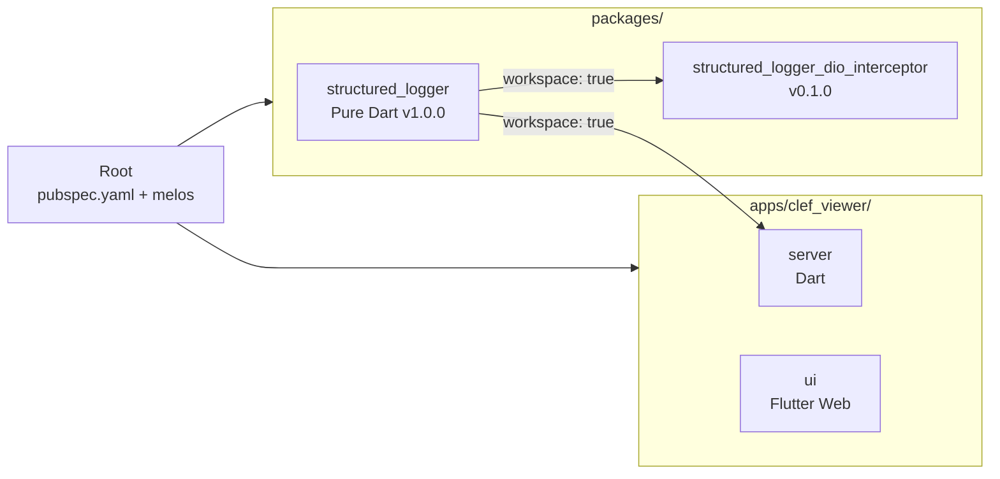
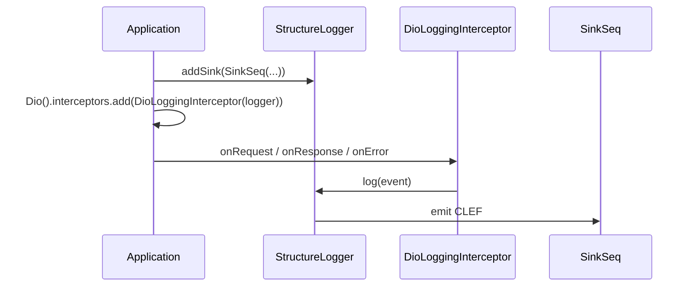
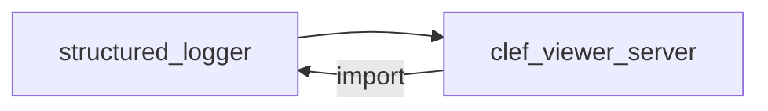
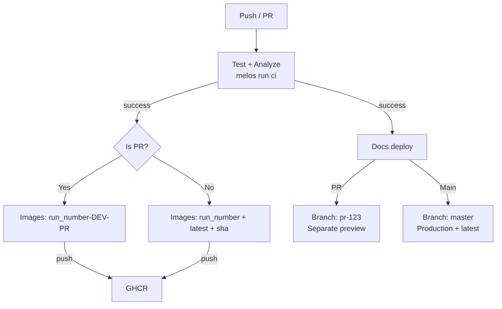

With the growth of the ecosystem, we decided to restructure the `structured_logger` package to better support pure Dart usage (CLI, servers) without depending on Flutter.

## Overview of the restructuring

The main goal was to separate the **core** of the package from the Flutter ecosystem, allowing it to be used directly in pure Dart projects.

## What changed

### 1. Monorepo with Pub Workspaces + Melos 8

- The root is now **meta-only** (just workspace configuration)
- Packages live in `packages/`
- Applications live in `apps/`

### 2. Core is now pure Dart (v1.0.0)

- Removed the `flutter` dependency
- Minimum SDK: `^3.6.0`
- `resolution: workspace` on all members
- Public API **100% compatible**

### 3. New integration package

### 4. Integration with CLEF Viewer

The server now depends directly on the core package via workspace:

We eliminated the manual copy of `seq_constants.dart`.

### 5. Smarter CI

## Why this matters

- Use in **pure Dart** without the Flutter SDK
- Centralized maintenance in the monorepo
- Automatic previews of images and docs on PRs
- `latest` always reflects the latest stable version from main

## Next steps

- Official release of `structured_logger` 1.0.0
- Release of `structured_logger_dio_interceptor`
- Complete migration guide

---

Thanks to everyone who tested the previous versions. Feedback is always welcome!