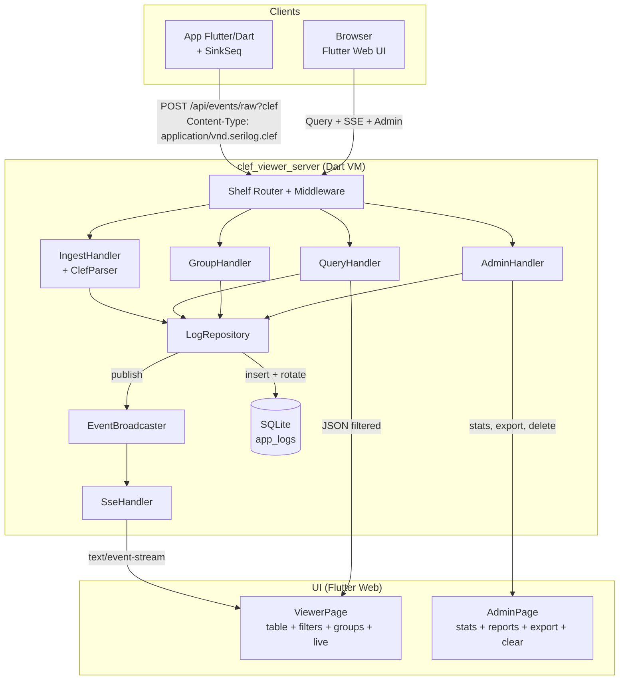
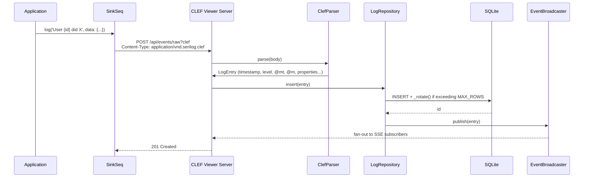
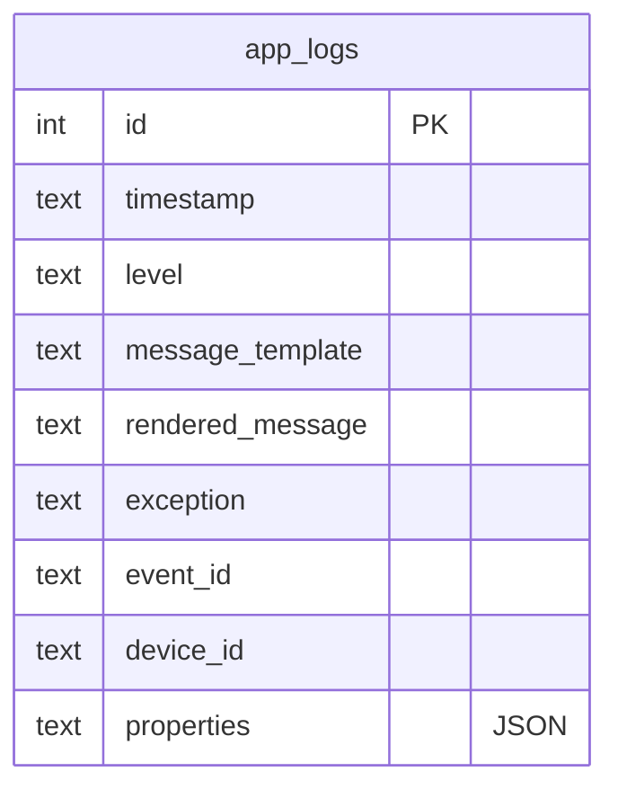
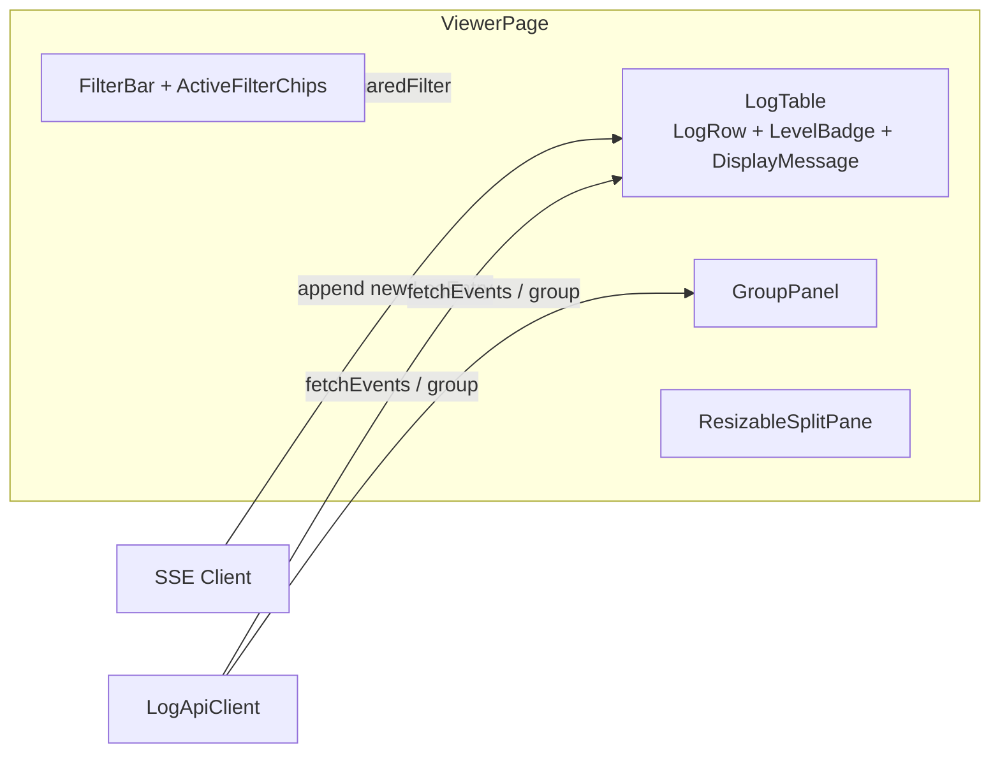
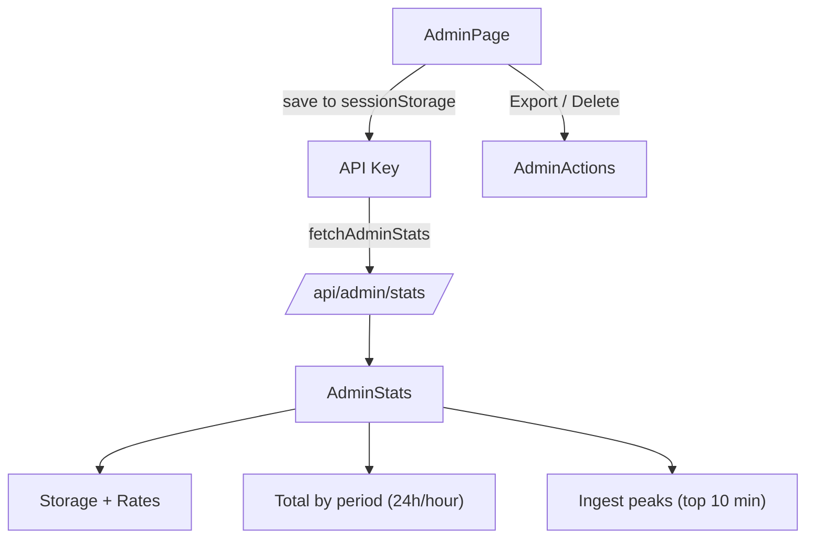
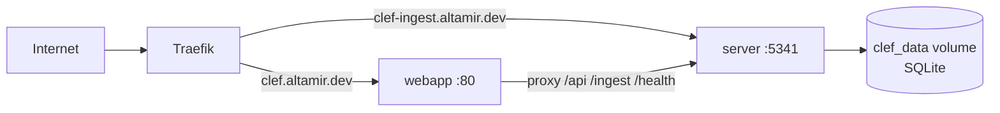

The **CLEF Viewer** is a lightweight, self-hosted webapp for receiving, storing, and visualizing structured logs in the CLEF format (compatible with Seq). It was created as a natural complement to `structured_logger` for developers who need observability in development and small production environments without depending on a full Seq instance.

<!--truncate-->

## Why a CLEF viewer?

Many Flutter/Dart projects rely on `print` or loose log statements. As an app grows, you need:

- Search and filtering by level, device, and properties
- Real-time visualization
- Grouping (by screen, error, user, etc.)
- CLEF export for later analysis or migration
- Bounded storage (no uncontrolled growth)

The CLEF Viewer solves this in a simple way: a Dart VM server + Flutter Web UI, all packaged in two lightweight Docker images.

It uses the **same default port as Seq (5341)**, so you only need to change the URL in `SinkSeq`.

## Overall architecture



The server serves both the API and the static UI assets in production (via `shelf_static`).

## Event ingest flow

`SinkSeq` (and any CLEF client) sends events to the server.



The parser supports both the classic Seq endpoint (`/api/events/raw?clef`) and the modern one (`/ingest/clef` with NDJSON).

## Storage model (SQLite)

A simple and efficient table:



Indexes on: `timestamp`, `level`, `device_id`, `event_id`.

**FIFO rotation**: when the number of rows exceeds `MAX_ROWS` (default 100k), the repository automatically deletes the oldest entries.

Database size is exposed in the Admin UI via `stat` on the `.db` file.

## Real-time visualization — Viewer

The **Viewer** tab is where you will spend most of your time:

- Event table with `LevelBadge` and rendered messages (uses `@m` or fills the template client-side with highlighted values)
- Rich filters: level, time range, device id, property filters (with editable active chips)
- Grouping (GroupPanel): by level, hour, device, or any custom property
- Resizable split pane (table × groups)
- **Live updates** via SSE (`/api/events/stream`): new events appear automatically at the top of the table (with a 3s polling fallback if the proxy blocks SSE)
- Export and actions respect the shared active filter between Viewer and Admin

Here is the **Viewer** interface in action (real screenshot):


**Elements visible in the Viewer screenshot:**

- Header with **Viewer** (active) | Admin tabs + short build versions (`webapp 9b1b282 · server 9b1b282`)
- Top filter bar:
  - **Levels** pills (All + debug selected in purple, error in red, etc.)
  - **From** / **To** date fields
  - **Device ID**: `mobile-ios`
  - **Property** (key=value): `UserId=215`
  - Search and Clear buttons
- **Active filter chips** right below (blue and removable): `level: debug`, `level: error`, `device: mobile-ios`, `property: UserId=215`
- Split layout:
  - Left sidebar **Groups** (grouped by Level): debug (4), error (1) with arrows
  - Main **Events** area (counter "5"):
    - Log rows with timestamp, level badge (purple for DEBUG, red for ERROR)
    - Message with **blue highlights** on dynamic values (e.g. `client-33`, `events.4`, `delete`, `success`)
    - Sub-line `device: mobile-ios`
    - Chevrons to expand each event
- Blue **Pause** button (bottom right) to pause the real-time stream

The blue highlights in the messages (e.g. `client-33`, `delete`, `success`) are generated by the `DisplayMessageText` component: it takes the event's `messageTemplate` and substitutes the placeholders with values from `properties`, visually highlighting each substituted value.

This screenshot perfectly demonstrates:
- Combined filters (level + device + property)
- Visual active filter chips (ActiveFilterChips)
- Real-time updated grouping on the side (GroupPanel)
- Rich message template rendering
- Events arriving via SSE (multiple "SSE client ... subscribed")



## Admin panel and reports

The **Admin** tab (protected by `ADMIN_API_KEY` via the `X-Seq-ApiKey` header) shows:

- **Storage**: database file size + total events
- **Reports**:
  - Logs/sec (last minute and average of the last hour)
  - Total by period (last 24h, grouped by hour) — horizontal bars
  - Ingest peaks (top 10 minutes in the last 24h)
- Actions: Export All CLEF / Export Filtered CLEF (compatible NDJSON), Clear All / Clear Filtered

The API key is stored **only in the browser's sessionStorage** (never in the URL).

Here is the **Admin** interface in production (real screenshot):


**Elements of the Admin screen:**

- Header with **Viewer | Admin** tabs (top right) + short build versions (`webapp 9b1b282 · server 9b1b282`)
- **API Key** field (masked values) + blue **Save to session** button (the key is stored **only** in the browser's `sessionStorage`)
- **Storage** card:
  - "Database size 15 MB"
  - "Total events 19500"
- **Reports** card:
  - Logs/sec (last minute): `0.00`
  - Logs/sec (average last hour): `5.42`
- **Total by period (last 24h, per hour)** — blue horizontal bars with timestamps and counts (e.g.: 2026-06-26 16:00 … 19000)
- **Ingest peaks (top 10 minutes, last 24h)** — ranked list (#1 2026-06-26 17:21 → 7774, #2 17:22 → 6467, etc.)
- Action row: **Export All CLEF** and **Export Filtered CLEF** (primary blue buttons) + **Clear All Logs** / **Clear Filtered** (secondary)

The shared active filter between Viewer and Admin means that "Export Filtered" and "Clear Filtered" use exactly the same query you see in the log table.

Both screenshots (Viewer and Admin) are included based on the real prints provided. The Mermaid diagrams complement them by explaining the architecture behind the UI.



The calculations are performed on the server (`countSince`, `countByHour`, `ingestPeaks`) and sent as JSON.

## Deployment and Docker

Two independent services:

| Service | Image | Port | Purpose |
|---------|-------|------|---------|
| `server` | `ghcr.io/altamir/clef-viewer-server` | 5341 | API + ingest + SSE + SQLite |
| `webapp` | `ghcr.io/altamir/clef-viewer-webapp` | 80 (nginx) | Flutter Web UI + reverse proxy for /api and /ingest |



In production (e.g. Hostinger VPS + Docker Manager + Traefik + Let's Encrypt):

- Images are published automatically by CI on every change under `apps/clef_viewer/`
- Just set `ADMIN_API_KEY`, the hosts, and deploy the compose file

Local development is simple:

```bash
# Server
cd apps/clef_viewer/server
DEV_MODE=true dart run bin/server.dart

# UI (another terminal)
cd ../ui
flutter run -d chrome --dart-define=CLEF_VIEWER_API=http://localhost:5341
```

Or use the provided `docker-compose.*.yml` files.

## Integration with structured_logger

No extra code is required in the logger:

```dart
import 'package:structured_logger/structured_logger.dart';
import 'dart:io';

final logger = StructureLogger()
  ..addSink(SinkSeq(
    'https://clef-ingest.altamir.dev',
    apiKey: Platform.environment['INGEST_API_KEY'],
    deviceIdentifier: 'my-production-app',
  ));

await logger.info('User {userId} viewed {screen}', data: {
  'userId': 42,
  'screen': 'Checkout',
});
```

The event appears in the UI in less than 1s via SSE.

## Summary

CLEF Viewer delivers a Seq-like experience for lightweight use cases:

- Native CLEF ingest (works with SinkSeq and other Serilog-style clients)
- Real-time + historical + grouping
- Practical Admin panel with export and cleanup
- Bounded and predictable storage
- Easy to run locally or on a VPS with Docker
- 100% inside the pure-Dart monorepo

It closes the loop: you emit with `structured_logger` → visualize instantly in CLEF Viewer → export when you need more power.

Try it:

```bash
git clone https://github.com/Altamir/structured_logger
cd apps/clef_viewer
# follow the README
```

Want to contribute? Issues and PRs are welcome — especially filter improvements, more chart types, and support for additional sinks in the viewer.

Thanks to everyone already using it in production! Feedback is always welcome.