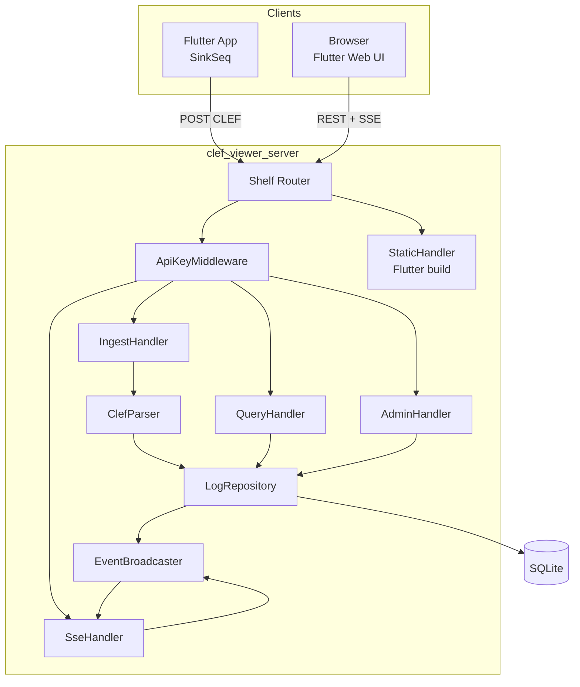

# Design Document: CLEF Viewer Webapp

**Baseado em:** [clef-viewer-requirements.md](clef-viewer-requirements.md)  
**Data:** 2026-06-26  
**Status:** Implementado — em operação na VPS (`clef.altamir.dev`); SSE tempo real validado (`42d126d`). Ver [TASKS.md](TASKS.md) e [ALTERACOES.md](ALTERACOES.md).

---

## Overview

O CLEF Viewer é um webapp local que substitui o Seq em fluxos de desenvolvimento: recebe eventos CLEF via HTTP (contrato compatível com [`SinkSeq`](../../lib/src/log_sinks/sink_seq.dart)), persiste em SQLite, e expõe uma UI Flutter Web para visualização em tempo real, filtros, agrupamentos e operações admin.

**Abordagem técnica:** dois pacotes Dart no monorepo — um servidor VM (`shelf`) e uma UI Flutter Web — com o servidor servindo a API, o stream SSE e os assets estáticos da UI em produção.

**Porta padrão:** `5341` (mesma do Seq), permitindo trocar apenas a URL no `SinkSeq`.

---

## Requirements Traceability

| Req | Design Section |
|-----|----------------|
| R1 — Ingestão CLEF | [Ingest API](#ingest-api), [ClefParser](#clefparser), [Decision: Seq Compatibility](#decision-seq-endpoint-compatibility) |
| R2 — SQLite | [LogRepository](#logrepository), [Data Models](#data-models) |
| R3 — Tempo real | [EventBroadcaster](#eventbroadcaster), [SSE API](#sse-api), [UI: ViewerPage](#viewerpage) |
| R4 — Filtros | [LogFilter](#logfilter), [Query API](#query-api) |
| R5 — Agrupamentos | [Group API](#group-api), [UI: GroupPanel](#grouppanel) |
| R6 — Admin | [Admin API](#admin-api), [UI: AdminPage](#adminpage) |
| NFR — Performance | [Performance Considerations](#performance-considerations) |
| NFR — Config | [AppConfig](#appconfig) |

---

## Research Findings

### CLEF / Seq Ingest Contract

**Sources:** [clef-json.org](https://clef-json.org/), [Seq Posting Raw Events](https://datalust.co/docs/posting-raw-events), [`sink_seq_test.dart`](../../test/log_sinks/sink_seq_test.dart)

**Key Insights:**
- `SinkSeq` envia `POST /api/events/raw?clef` com body JSON único e header `Content-Type: application/vnd.serilog.clef`
- Campos reservados (`@t`, `@mt`, `@l`, `DeviceIdentifier`) prevalecem sobre chaves conflitantes em `data`
- Seq aceita também `POST /ingest/clef` com NDJSON batch
- API key via header `X-Seq-ApiKey` (constante em [`seq_constants.dart`](../../lib/src/log_sinks/seq_constants.dart))

**Impact on Design:** Endpoints legado e moderno são obrigatórios no MVP; parser CLEF deve espelhar a lógica do `SinkSeq` na direção inversa (deserialização → `LogEntry`).

### Dart Server Stack

**Sources:** [shelf](https://pub.dev/packages/shelf), [sqlite3](https://pub.dev/packages/sqlite3), [shelf_router](https://pub.dev/packages/shelf_router)

**Key Insights:**
- `shelf` + `shelf_router` cobrem REST e middleware de auth de forma idiomática
- `sqlite3` oferece SQLite nativo no Dart VM (sem Flutter), adequado para servidor standalone
- SSE é implementável com `shelf` retornando `Stream<List<int>>` e headers `text/event-stream`
- `shelf_static` serve o build Flutter Web (`ui/build/web`)

**Impact on Design:** Servidor é pacote Dart puro (sem Flutter SDK); UI é pacote Flutter separado.

### SQLite Hybrid Schema

**Sources:** [plans/spike/clef-sinks-e-sql.md](../spike/clef-sinks-e-sql.md), [SQLite JSON1](https://sqlite.org/json1.html)

**Key Insights:**
- Propriedades CLEF são dinâmicas; coluna `properties TEXT` (JSON) + índices em colunas fixas é o padrão recomendado no spike
- `json_extract(properties, '$.Key')` suporta filtros e agrupamentos por propriedade customizada
- Rotação FIFO via `DELETE ... ORDER BY timestamp ASC LIMIT excess`

**Impact on Design:** `LogRepository` centraliza SQL dinâmico com parâmetros; export reconstrói CLEF mesclando colunas + properties.

---

## Architecture

### System Overview



### Component Architecture

| Camada | Pacote | Responsabilidade |
|--------|--------|------------------|
| **Ingest** | `server` | Receber CLEF, validar, persistir, broadcast |
| **Query** | `server` | Listar, filtrar, agrupar eventos |
| **Admin** | `server` | Delete e export CLEF |
| **Realtime** | `server` | SSE com heartbeat e fan-out |
| **UI** | `ui` | Viewer, filtros, agrupamentos, admin |
| **Persistence** | `server` | SQLite schema, migrations, rotação |

### Data Flow

**Ingestão:**
```
HTTP POST → ApiKeyMiddleware → IngestHandler
  → ClefParser.parse(body) → LogEntry
  → LogRepository.insert(entry) → SQLite
  → EventBroadcaster.publish(entry)
  → HTTP 201
```

**Visualização em tempo real:**
```
Browser → GET /api/events/stream (SSE)
  → SseHandler subscribes EventBroadcaster
  → on connect: emit ": connected\n\n"
  → on new LogEntry: emit "data: {json}\n\n"
  → every 30s: emit ": heartbeat\n\n"
  → Response context: shelf.io.buffer_output = false (obrigatório para shelf_io)
```

**Consulta com filtros:**
```
Browser → GET /api/events?level=error&from=...
  → QueryHandler → LogFilter.fromQuery(params)
  → LogRepository.query(filter) → JSON response
```

### Technology Stack

| Componente | Tecnologia | Versão alvo |
|------------|------------|-------------|
| HTTP Server | `shelf`, `shelf_router` | latest stable |
| Static files | `shelf_static` | latest stable |
| Database | `sqlite3` | latest stable |
| JSON | `dart:convert` | SDK |
| Constants | `structured_logger` (path dep) | workspace |
| UI | Flutter Web | SDK >=3.1.5 |
| HTTP Client (UI) | `http` | ^1.1.0 |
| SSE Client (UI) | `eventsource` ou implementação manual | TBD |

### Project Structure

```
apps/clef_viewer/
├── server/                         # Dart VM — sem Flutter
│   ├── pubspec.yaml
│   ├── bin/server.dart
│   ├── lib/
│   │   ├── clef_viewer_server.dart
│   │   ├── config.dart
│   │   ├── api/
│   │   │   ├── router.dart
│   │   │   ├── ingest_handler.dart
│   │   │   ├── query_handler.dart
│   │   │   ├── group_handler.dart
│   │   │   ├── admin_handler.dart
│   │   │   ├── sse_handler.dart
│   │   │   └── middleware/
│   │   │       └── api_key_middleware.dart
│   │   ├── clef/
│   │   │   ├── clef_parser.dart
│   │   │   └── clef_serializer.dart
│   │   ├── db/
│   │   │   ├── database.dart
│   │   │   ├── schema.dart
│   │   │   └── log_repository.dart
│   │   ├── models/
│   │   │   ├── log_entry.dart
│   │   │   ├── log_filter.dart
│   │   │   └── group_result.dart
│   │   └── stream/
│   │       └── event_broadcaster.dart
│   └── test/
└── ui/                             # Flutter Web
    ├── pubspec.yaml
    ├── lib/
    │   ├── main.dart
    │   ├── app.dart
    │   ├── config/
    │   │   └── api_config.dart
    │   ├── models/
    │   │   └── log_entry.dart
    │   ├── services/
    │   │   ├── log_api_client.dart
    │   │   └── sse_client.dart
    │   ├── pages/
    │   │   ├── viewer_page.dart
    │   │   └── admin_page.dart
    │   └── widgets/
    │       ├── log_table.dart
    │       ├── log_row.dart
    │       ├── filter_bar.dart
    │       ├── group_panel.dart
    │       └── level_badge.dart
    └── test/
```

---

## Architecture Decisions

### Decision: Split Server and UI Packages

**Context:** Dart VM server não deve depender do Flutter SDK; Flutter Web precisa do SDK completo.

**Options:**

| Option | Pros | Cons | Effort |
|--------|------|------|--------|
| Pacote único misto | Um `pubspec.yaml` | Conflito de dependências Flutter/VM | High |
| **Dois pacotes (`server` + `ui`)** | Separação limpa, builds independentes | Duplicar model `LogEntry` (DTO) | Low |
| UI HTML/JS puro | Sem Flutter | Inconsistente com ecossistema Dart | Medium |

**Decision:** Dois pacotes em `apps/clef_viewer/server` e `apps/clef_viewer/ui`.

**Rationale:** Alinhado ao requisito Dart/Flutter; servidor roda com `dart run` sem toolchain Flutter em CI de backend.

**Implications:** `LogEntry` existe em ambos os pacotes como DTO JSON-compatível; sem pacote shared no MVP.

---

### Decision: Seq Endpoint Compatibility

**Context:** `SinkSeq` hardcoded para `/api/events/raw?clef`; trocar URL deve ser suficiente.

**Decision:** Implementar ambos endpoints no MVP; resposta HTTP 201 (Seq aceita 200–201).

**Rationale:** Testes em `sink_seq_test.dart` validam path `/api/events/raw?clef` — regressão zero para consumidores existentes.

**Implications:** `IngestHandler` delega para `ClefParser` comum; paths diferentes, lógica idêntica.

---

### Decision: Real-time via SSE (not WebSocket)

**Context:** UI precisa receber eventos push; servidor é unidirecional (server → client).

**Options:**

| Option | Pros | Cons |
|--------|------|------|
| **SSE** | Simples com HTTP, reconexão nativa, shelf-friendly | Unidirecional (suficiente) |
| WebSocket | Bidirecional | Mais complexo, overkill para MVP |
| Long polling | Sem SSE | Latência maior, mais requests |

**Decision:** SSE em `GET /api/events/stream`.

**Rationale:** Requisito é server-push; SSE atende com menos código e reconexão trivial.

**Implications:** `EventBroadcaster` usa `StreamController<LogEntry>.broadcast()`; heartbeat timer de 30s no `SseHandler`.

---

### Decision: Desabilitar buffer do shelf_io para SSE

**Context:** Respostas chunked com `Stream<List<int>>` no `shelf_io` não chegavam ao cliente (HTTP 200, 0 bytes) — nem em testes TCP locais nem na VPS.

**Causa:** `HttpResponse.bufferOutput` é `true` por padrão no adapter `shelf_io`.

**Decision:** Toda resposta SSE define `context: {'shelf.io.buffer_output': false}`.

**Rationale:** Única forma confiável de streaming em tempo real com `dart:io`; proxies (nginx/Traefik) são camada adicional, não substituem esse flag.

**Implications:** Testes de integração devem usar `HttpClient` real (`sse_shelf_io_test.dart`), não apenas `response.read()` in-process.

---

### Decision: API Key Auth (Seq-style)

**Context:** Admin precisa proteção; ingestão pode ser aberta em dev ou protegida em rede compartilhada.

**Decision:**
- `INGEST_API_KEY` opcional — se setada, exige `X-Seq-ApiKey` em rotas de ingestão
- `ADMIN_API_KEY` obrigatória em produção — exige header em `/api/admin/*`
- UI armazena admin key em `sessionStorage` (nunca na URL)

**Rationale:** Compatível com `SinkSeq(apiKey: ...)` e familiar para usuários Seq.

---

### Decision: Default Port 5341

**Context:** Ferramenta substitui Seq localmente.

**Decision:** `PORT` default `5341`.

**Rationale:** Drop-in replacement — `SinkSeq('http://localhost:5341')` funciona sem lembrar porta customizada.

---

## Components and Interfaces

### AppConfig

**Purpose:** Centralizar configuração via variáveis de ambiente.

```dart
class AppConfig {
  final int port;              // default: 5341
  final String dbPath;         // default: ./clef_viewer.db
  final String? ingestApiKey;  // env: INGEST_API_KEY
  final String? adminApiKey;   // env: ADMIN_API_KEY
  final int maxRows;           // default: 100_000
  final String staticPath;     // default: ../ui/build/web
  final int maxEventBytes;     // default: 1_048_576 (1 MB)

  factory AppConfig.fromEnvironment();
}
```

| Variável | Default | Descrição |
|----------|---------|-----------|
| `PORT` | `5341` | Porta HTTP |
| `DB_PATH` | `./clef_viewer.db` | Arquivo SQLite |
| `INGEST_API_KEY` | `null` | Se setada, protege ingestão |
| `ADMIN_API_KEY` | `null` | Protege admin (warn se null em stderr) |
| `MAX_ROWS` | `100000` | Rotação FIFO |
| `STATIC_PATH` | `../ui/build/web` | Assets Flutter |

---

### ClefParser

**Purpose:** Converter payload CLEF (JSON) em `LogEntry` persistível.

**Responsibilities:**
- Parse single JSON object ou NDJSON batch
- Extrair campos reservados para colunas indexáveis
- Mover propriedades restantes para `properties` JSON
- Aplicar defaults (`@t` → UTC now, `@l` → `information`)
- Rejeitar payloads > `maxEventBytes`

**Reserved field mapping:**

| CLEF key | DB column | Notes |
|----------|-----------|-------|
| `@t` | `timestamp` | ISO-8601 UTC |
| `@l` | `level` | default `information` |
| `@mt` | `message_template` | |
| `@m` | `rendered_message` | |
| `@x` | `exception` | |
| `@i` | `event_id` | |
| `DeviceIdentifier` | `device_id` | |
| `@r` | stored in `properties` | array, preserved in JSON |
| demais keys | `properties` | excluindo reservados |

**Interface:**

```dart
class ClefParser {
  ClefParser({required int maxEventBytes});

  /// Single JSON object. Throws [ClefParseException] on invalid input.
  LogEntry parseObject(Map<String, dynamic> json);

  /// NDJSON text — skips blank lines, returns valid entries.
  /// Throws on first invalid line (no partial persist in same request).
  List<LogEntry> parseNdjson(String body);
}
```

**Reserved fields set** (não vão para `properties`):
```
@t, @l, @mt, @m, @x, @i, DeviceIdentifier
```

---

### ClefSerializer

**Purpose:** Reconstruir CLEF para export admin.

```dart
class ClefSerializer {
  /// Merge columns + properties into CLEF map (export order: timestamp ASC).
  Map<String, dynamic> toClef(LogEntry entry);

  /// NDJSON line for export file.
  String toNdjsonLine(LogEntry entry);
}
```

**Export format:** uma linha JSON por evento, campos `@t`, `@mt`, `@l`, etc. no topo, `DeviceIdentifier` se presente, demais em flat merge (mesmo formato que `SinkSeq` envia).

---

### LogEntry

**Purpose:** Entidade persistida e transmitida via API/SSE.

| Field | Type | Required | Description |
|-------|------|----------|-------------|
| `id` | `int` | após insert | PK auto-increment |
| `timestamp` | `String` | Yes | ISO-8601 (`@t`) |
| `level` | `String` | Yes | `@l` |
| `messageTemplate` | `String?` | No | `@mt` |
| `renderedMessage` | `String?` | No | `@m` |
| `exception` | `String?` | No | `@x` |
| `eventId` | `String?` | No | `@i` |
| `deviceId` | `String?` | No | `DeviceIdentifier` |
| `properties` | `Map<String, dynamic>` | Yes | demais propriedades |

**Example (API/SSE JSON):**

```json
{
  "id": 42,
  "timestamp": "2024-01-01T00:00:00.000Z",
  "level": "info",
  "messageTemplate": "Hello {name}",
  "renderedMessage": null,
  "exception": null,
  "eventId": null,
  "deviceId": "my-device",
  "properties": { "name": "John" }
}
```

---

### LogFilter

**Purpose:** Objeto compartilhado entre query, group, delete e export.

```dart
class LogFilter {
  final DateTime? from;
  final DateTime? to;
  final List<String>? levels;
  final String? deviceId;
  final String? eventId;
  final String? propertyKey;
  final String? propertyValue;
  final String? search;

  factory LogFilter.fromQueryParams(Map<String, String> params);

  /// Validates from <= to. Throws [ValidationException] if invalid.
  void validate();

  /// SQL WHERE clause + bound parameters (parameterized, no injection).
  (String where, List<Object?> params) toSql();
}
```

**Query parameter mapping:**

| Param | Type | Example |
|-------|------|---------|
| `from` | ISO-8601 | `2024-01-01T00:00:00Z` |
| `to` | ISO-8601 | `2024-01-02T00:00:00Z` |
| `levels` | comma-separated | `error,warning` |
| `device_id` | string | `my-device` |
| `event_id` | string | `abc-123` |
| `property` | `key=value` | `UserId=42` |
| `search` | string | `timeout` |
| `limit` | int | `100` (default) |
| `offset` | int | `0` (default) |

---

### LogRepository

**Purpose:** Única camada de acesso ao SQLite.

```dart
class LogRepository {
  LogRepository(Database db, {required int maxRows});

  Future<LogEntry> insert(LogEntry entry);
  Future<QueryResult> query(LogFilter filter, {int limit, int offset});
  Future<List<GroupResult>> group(LogFilter filter, GroupBy groupBy);
  Future<int> delete(LogFilter filter);       // empty filter = delete all
  Stream<LogEntry> export(LogFilter filter);  // lazy stream, timestamp ASC
  Future<int> count(LogFilter filter);
  Future<void> ensureSchema();
}
```

**Insert with rotation (pseudocode):**

```sql
BEGIN TRANSACTION;
INSERT INTO app_logs (...) VALUES (...);
DELETE FROM app_logs WHERE id IN (
  SELECT id FROM app_logs
  ORDER BY timestamp ASC
  LIMIT MAX(0, (SELECT COUNT(*) FROM app_logs) - :maxRows)
);
COMMIT;
```

**Concurrency:** retry em `SqliteException` código `SQLITE_BUSY` — 3 tentativas, backoff 50ms/100ms/200ms.

**Group SQL examples:**

```sql
-- group_by=level
SELECT level AS key, COUNT(*) AS count
FROM app_logs WHERE ... GROUP BY level ORDER BY count DESC LIMIT 100;

-- group_by=time&bucket=hour
SELECT strftime('%Y-%m-%dT%H:00:00Z', timestamp) AS key, COUNT(*) AS count
FROM app_logs WHERE ... GROUP BY key ORDER BY key;

-- group_by=property&property=Screen
SELECT COALESCE(json_extract(properties, '$.Screen'), '(empty)') AS key,
       COUNT(*) AS count
FROM app_logs WHERE ... GROUP BY key ORDER BY count DESC LIMIT 100;
```

---

### EventBroadcaster

**Purpose:** Fan-out de novos eventos para clientes SSE.

```dart
class EventBroadcaster {
  Stream<LogEntry> get stream;

  void publish(LogEntry entry);
  void dispose();
}
```

- `StreamController.broadcast()` — múltiplas abas SSE
- Publicação síncrona após commit SQLite no `insert`
- Sem buffer de replay no MVP (cliente recarrega via `GET /api/events` ao reconectar)

---

## API Specification

### Ingest API

#### `POST /api/events/raw?clef`

Compatível com `SinkSeq`.

| Header | Value | Required |
|--------|-------|----------|
| `Content-Type` | `application/vnd.serilog.clef` | Yes |
| `X-Seq-ApiKey` | API key | If `INGEST_API_KEY` set |

**Body:** single JSON object

**Response:** `201 Created` (body vazio)

#### `POST /ingest/clef`

| Header | Value | Required |
|--------|-------|----------|
| `Content-Type` | `application/vnd.serilog.clef` OR `application/x-ndjson` | Yes |
| `X-Seq-ApiKey` | API key | If `INGEST_API_KEY` set |

**Body:** single JSON **or** NDJSON (one event per line)

**Response:** `201 Created`

```json
{ "ingested": 3 }
```

---

### Query API

#### `GET /api/events`

| Param | Default | Description |
|-------|---------|-------------|
| `limit` | `100` | Max 1000 |
| `offset` | `0` | Pagination |
| + filter params | | See [LogFilter](#logfilter) |

**Response `200`:**

```json
{
  "events": [ { "id": 1, "timestamp": "...", "level": "info", ... } ],
  "total": 1523,
  "limit": 100,
  "offset": 0
}
```

---

### Group API

#### `GET /api/events/group`

| Param | Required | Values |
|-------|----------|--------|
| `group_by` | Yes | `level`, `time`, `device_id`, `property` |
| `bucket` | If `group_by=time` | `minute`, `hour`, `day` |
| `property` | If `group_by=property` | e.g. `Screen` |
| + filter params | No | Same as query |

**Response `200`:**

```json
{
  "groups": [
    { "key": "error", "count": 15 },
    { "key": "info", "count": 200 }
  ]
}
```

---

### SSE API

#### `GET /api/events/stream`

**Headers response:**
```
Content-Type: text/event-stream; charset=utf-8
Cache-Control: no-cache, no-transform
Connection: keep-alive
X-Accel-Buffering: no
```

**Response context (shelf_io):**
```dart
context: {'shelf.io.buffer_output': false}
```
Sem isso, o servidor retorna HTTP 200 mas **0 bytes** no corpo (buffer interno do `dart:io`).

**Events:**

| Formato | Conteúdo | When |
|---------|----------|------|
| `: connected\n\n` | comentário SSE | Ao conectar |
| `data: {json}\n\n` | `LogEntry` JSON (mensagem padrão) | Novo evento ingerido |
| `: heartbeat\n\n` | comentário SSE | A cada 30s |

**Example:**
```
: connected

data: {"id":43,"timestamp":"2024-01-01T00:00:01.000Z","level":"info",...}

: heartbeat

```

**Optional query `last_id`:** no MVP, ignorado — cliente refaz `GET /api/events?limit=100` ao reconectar para evitar gaps.

---

### Admin API

Todas as rotas exigem `X-Seq-ApiKey` = `ADMIN_API_KEY`.

#### `DELETE /api/admin/logs`

Aceita mesmos filter params de query. Sem params = delete all.

**Response `200`:**

```json
{ "deleted": 1523 }
```

#### `GET /api/admin/export`

Aceita filter params. Retorna arquivo NDJSON.

**Response `200`:**
```
Content-Type: application/x-ndjson
Content-Disposition: attachment; filename="logs-20240626T120000Z.clef"
```

Corpo: linhas CLEF (via `ClefSerializer`), ordenadas `timestamp ASC`.

---

### Health API

#### `GET /health`

**Response `200`:** `{ "status": "ok", "events": 1523 }`

---

## UI Design

### Navigation

```
App
├── /          → ViewerPage (default)
└── /admin     → AdminPage
```

AppBar com link Viewer ↔ Admin.

### ViewerPage

```
┌─────────────────────────────────────────────────────────────┐
│ CLEF Viewer                              [Admin] [Pause ⏸] │
├─────────────────────────────────────────────────────────────┤
│ From [datetime] To [datetime]  Levels [multi-select ▼]      │
│ Device ID [________]  Event ID [________]  Property [k=v]   │
│ Search [________________________]              [Apply] [Clear]│
├──────────────────────────┬──────────────────────────────────┤
│ Group by: [level ▼]      │  Events (1523 total)               │
│ ┌────────────────────┐   │  ┌──────────────────────────────┐ │
│ │ error      15  [→] │   │  │ 12:00:01 INFO  Hello {name}  │ │
│ │ info      200  [→] │   │  │   device: my-device          │ │
│ │ warning    8  [→] │   │  │   props: { name: "John" }    ▼│ │
│ └────────────────────┘   │  ├──────────────────────────────┤ │
│                          │  │ 12:00:02 ERROR Request fail  │ │
│                          │  └──────────────────────────────┘ │
└──────────────────────────┴──────────────────────────────────┘
```

**Behaviors:**
- SSE conecta ao montar; botão Pause desconecta/reconecta
- Fallback: polling silencioso a cada 3s se SSE falhar atrás de proxy
- Novos eventos aparecem no topo; lista limitada a 1000 em memória
- Clique em grupo aplica filtro e alterna painel para lista
- `LogRow` expandível mostra `properties` JSON formatado
- Filtros ativos aplicados client-side em eventos SSE + server-side na carga inicial
- Badge de cor por level (`error`=vermelho, `warning`=amarelo, etc.)

### AdminPage

```
┌─────────────────────────────────────────────────────────────┐
│ Admin                                        [Back to Viewer]│
├─────────────────────────────────────────────────────────────┤
│ API Key: [••••••••••••]  [Save to session]                   │
├─────────────────────────────────────────────────────────────┤
│ Storage: 1.523 events                                        │
│                                                              │
│ [Export All CLEF]  [Export Filtered CLEF]                   │
│                                                              │
│ [Clear All Logs]  ← confirmation dialog                     │
│ [Clear Filtered]  ← uses active filters from viewer          │
└─────────────────────────────────────────────────────────────┘
```

**Behaviors:**
- API key em `sessionStorage` key `clef_viewer_admin_key`
- Clear All exige dialog: "This will permanently delete all logs. Continue?"
- Export usa `fetch` + blob download
- Erros 401 mostram "Invalid API key"

### SseClient (UI)

```dart
class SseClient {
  Stream<LogEntry> connect({Uri baseUrl});
  void disconnect();
  // Auto-reconnect: 1s, 2s, 4s, 8s, 16s, 30s (cap)
}
```

### LogApiClient (UI)

```dart
class LogApiClient {
  Future<QueryResult> fetchEvents(LogFilter filter, {int limit, int offset});
  Future<List<GroupResult>> fetchGroups(GroupBy groupBy, LogFilter filter);
  Future<int> deleteLogs({LogFilter? filter, required String apiKey});
  Future<void> exportLogs({LogFilter? filter, required String apiKey});
}
```

---

## Error Handling

### Error Categories

| Category | Examples |
|----------|----------|
| Validation | Malformed JSON, invalid date range, unknown `group_by` |
| Authentication | Missing/invalid `X-Seq-ApiKey` |
| Payload | Event > 1 MB |
| Storage | SQLite busy, disk full |
| System | Unhandled exception |

### Error Response Format

```json
{
  "error": {
    "code": "INVALID_JSON",
    "message": "Request body is not valid JSON"
  }
}
```

### Error Response Strategy

| Scenario | HTTP | Code | User Message | System Action |
|----------|------|------|--------------|---------------|
| Malformed JSON | 400 | `INVALID_JSON` | "Invalid request body" | stderr log |
| Invalid filter dates | 400 | `INVALID_FILTER` | "From date must be before to date" | — |
| Missing API key | 401 | `UNAUTHORIZED` | "API key required" | — |
| Wrong API key | 401 | `UNAUTHORIZED` | "Invalid API key" | — |
| Event too large | 413 | `PAYLOAD_TOO_LARGE` | "Event exceeds 1 MB limit" | stderr log |
| SQLite busy (retries exhausted) | 503 | `STORAGE_BUSY` | "Storage temporarily unavailable" | stderr log |
| Disk full | 507 | `STORAGE_FULL` | "Storage full" | stderr log |
| Unhandled error | 500 | `INTERNAL_ERROR` | "Internal server error" | stderr stack trace |

### Recovery Mechanisms

- **SQLite busy:** retry 3x com backoff exponencial no `LogRepository`
- **SSE disconnect:** UI reconnect com backoff (1s → 30s cap); full reload via REST
- **Ingest failure:** nenhum partial write — transação SQLite all-or-nothing por request

---

## Performance Considerations

| Operation | Target | Strategy |
|-----------|--------|----------|
| Ingest single event | < 200ms | Insert + async broadcast; índices em timestamp |
| Query last 100 events | < 500ms @ 100k rows | `ORDER BY timestamp DESC LIMIT` com índice |
| SSE delivery | < 2s | Publish após commit; sem batching |
| Group query | < 1s | `LIMIT 100` em grupos; índices em level/device |

**Limits:**
- `limit` query param max: 1000
- Group results max: 100 rows
- In-memory UI list max: 1000 events

---

## Testing Strategy

### Unit Tests (server)

| Component | Focus |
|-----------|-------|
| `ClefParser` | Reserved fields, defaults, NDJSON, oversized payload |
| `ClefSerializer` | Round-trip: parse → serialize ≈ original CLEF |
| `LogFilter` | SQL generation, validation, injection safety |
| `LogRepository` | Insert, rotation FIFO, filter queries, group SQL |

**Coverage target:** 80%+ em `clef/` e `db/`

### Integration Tests (server)

Usar `package:test` + `package:http` contra servidor in-process (`shelf_io.serve` com porta 0).

| Test | Validates |
|------|-----------|
| `SinkSeq` compatibility | Replay requests de `sink_seq_test.dart` contra ingest endpoint |
| Ingest → Query | POST event, GET returns same data |
| Ingest → SSE | POST event, SSE client receives within 2s |
| Admin auth | 401 sem key, 200 com key |
| Export format | NDJSON válido, importável no Seq |
| Delete atomicity | Delete durante ingest não corrompe DB |

### UI Tests (Flutter)

| Test | Type |
|------|------|
| FilterBar validation | Widget test |
| LogTable renders events | Widget test |
| Admin confirmation dialog | Widget test |

### Manual Acceptance Tests

Checklist mapeado 1:1 aos critérios EARS em [clef-viewer-requirements.md](clef-viewer-requirements.md).

### Performance Tests

Script que insere 10k eventos e mede:
- p95 ingest latency < 200ms
- query 100 events p95 < 500ms

---

## Deployment & Development Workflow

### Local Development

```bash
# Terminal 1 — server
cd apps/clef_viewer/server
DEV_MODE=true dart run bin/server.dart

# Terminal 2 — UI (dev mode)
cd apps/clef_viewer/ui
flutter run -d chrome --web-port 8080 --dart-define=CLEF_VIEWER_API=http://localhost:5341
```

### Docker local (build)

```bash
cd apps/clef_viewer
docker compose -f docker-compose.yml -f docker-compose.build.yml -f docker-compose.dev.yml up --build
```

### Produção VPS (Hostinger — imagens públicas)

```yaml
# docker-compose.yml — apenas pull, sem build
services:
  server:
    image: ghcr.io/altamir/clef-viewer-server:latest
  webapp:
    image: ghcr.io/altamir/clef-viewer-webapp:latest
```

- CI: `.github/workflows/clef-viewer-images.yml` — injeta `CLEF_VIEWER_VERSION=${{ github.sha }}` no build
- webapp nginx → `http://server:5341` (rede interna Compose)
- Traefik: labels em `docker-compose.yml` (`CLEF_UI_HOST`, `CLEF_INGEST_HOST`)
- Firewall: `80`/`443` com Traefik; ingest exposto em subdomínio HTTPS
- **Sem variáveis novas no painel** para versão ou SSE — redeploy com pull de `:latest` basta

### Flutter App Integration

```dart
final sink = SinkSeq(
  'https://clef-ingest.example.com', // HTTPS obrigatório atrás de Traefik
  apiKey: Platform.environment['INGEST_API_KEY'],
  deviceIdentifier: 'my-app-dev',
);
```

### SSE no Flutter Web

| Camada | Detalhe |
|--------|---------|
| Servidor | `shelf.io.buffer_output: false`; `data: {json}\n\n`; `: connected` / `: heartbeat`; `X-Accel-Buffering: no` |
| nginx | `gzip off`, `proxy_buffering off`, `proxy_request_buffering off` em `/api/events/stream` |
| Traefik | `clef-sse` middleware + `flushInterval=1ms` no router da UI |
| Browser | `sse_client_web.dart` — `EventSource.onMessage`, URL absoluta same-origin |
| UI fallback | `viewer_page.dart` — polling 3s silencioso |
| VM / testes | `sse_client_io.dart` — `http.Client` stream; `sse_shelf_io_test.dart` valida TCP real |

Export condicional em `ui/lib/services/sse_client.dart`.

### Versão de deploy na UI

- Widget `VersionBar` no `AppBar.bottom`
- Exibe `webapp <sha7> · server <sha7>` — prefixos devem coincidir após redeploy conjunto
- Server: `GET /health` → `{ "status", "events", "version" }`
- Webapp: `String.fromEnvironment('CLEF_VIEWER_VERSION')` no build Docker/CI

---

## Quality Checklist

**Completeness:**
- [x] All 6 requirements addressed
- [x] Major components defined (7 server + 4 UI services)
- [x] Data models cover ingest, storage, API, export
- [x] Error handling covers ingest, auth, storage, SSE
- [x] Testing strategy covers unit, integration, acceptance

**Clarity:**
- [x] API endpoints fully specified with request/response
- [x] Component interfaces defined in Dart
- [x] UI wireframes for Viewer and Admin

**Feasibility:**
- [x] Stack uses mature Dart packages
- [x] Performance targets achievable with SQLite indexes
- [x] SinkSeq compatibility validated against existing tests

**Traceability:**
- [x] Requirements mapping table at top
- [x] Each API endpoint maps to acceptance criteria

---

## Next Steps

1. ~~Implementar server + UI~~ ✅
2. ~~Deploy VPS Hostinger + GHCR~~ ✅
3. ~~Fix SSE (`EventSource` + `onMessage` + nginx)~~ ✅ — [T32](TASKS.md)
4. ~~Barra de versão na UI~~ ✅ — [T35](TASKS.md)
5. ~~SSE shelf_io (`buffer_output: false`)~~ ✅ — `42d126d`, validado em produção
6. Executar [checklist de aceitação manual](TASKS.md#aceitação-manual) (itens restantes)
7. Publicar nova versão `structured_logger` com fix `SinkSeq` redirect
8. (Backlog) Migrar `dart:html` → `package:web`; grupos em tempo real via SSE