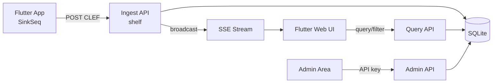

> Documento de requisitos (EARS) para um webapp Dart/Flutter que ingere eventos CLEF via HTTP (compatível com SinkSeq), persiste em SQLite, exibe logs em tempo real com filtros/agrupamentos, e oferece área admin protegida por API key.

# Requirements Document: CLEF Viewer Webapp

## Overview

Webapp complementar ao pacote [structured_logger](lib/structured_logger.dart) que funciona como receptor local de logs CLEF — alternativa leve ao Seq para desenvolvimento e debug. Apps Flutter configuram `SinkSeq` (ou futuro `SinkWebhook`) apontando para este servidor em vez de um Seq remoto.

**Decisões confirmadas:**
- Stack: **Dart** (backend `shelf`) + **Flutter Web** (UI)
- Storage: **SQLite** como persistência principal
- Auth: **API key** estilo Seq (`X-Seq-ApiKey`)



---

## User Roles

| Role | Descrição |
|------|-----------|
| **Developer** | Envia logs do app Flutter; consulta stream em tempo real com filtros |
| **Operator/Admin** | Limpa storage, exporta arquivo CLEF; operações protegidas por API key |

---

## Requirement 1: Ingestão CLEF

**User Story:** As a developer, I want to send CLEF events via HTTP using the same contract as Seq, so that I can point `SinkSeq` to this server without code changes.

**Acceptance Criteria:**
1. WHEN client sends `POST /api/events/raw?clef` with `Content-Type: application/vnd.serilog.clef` and a single JSON object THEN system SHALL persist the event and respond with HTTP 201
2. WHEN client sends `POST /ingest/clef` with a single JSON object OR NDJSON batch (one event per line) THEN system SHALL persist all valid events and respond with HTTP 201
3. WHEN CLEF body contains reserved fields (`@t`, `@mt`, `@l`, `@x`, `@i`, `@m`, `@r`) THEN system SHALL store them without loss; properties extras SHALL be stored in `properties` JSON column
4. WHEN `DeviceIdentifier` is present in the CLEF payload THEN system SHALL index it as `device_id` for filtering/grouping
5. WHEN event lacks `@t` THEN system SHALL assign server timestamp (ISO-8601 UTC) before persisting
6. WHEN event lacks `@l` THEN system SHALL default level to `information`
7. IF `INGEST_API_KEY` is configured AND request lacks valid `X-Seq-ApiKey` header THEN system SHALL respond with HTTP 401
8. WHEN body is malformed JSON THEN system SHALL respond with HTTP 400 and SHALL NOT persist partial data

**Compatibilidade com pacote existente:** O [`SinkSeq`](lib/src/log_sinks/sink_seq.dart) já envia para `/api/events/raw?clef` com header `application/vnd.serilog.clef` — o endpoint legado é obrigatório no MVP.

**Edge Cases:**
- Batch NDJSON com linhas vazias: ignorar linhas em branco, persistir válidas
- Propriedades em `data` que conflitam com campos reservados: campos reservados CLEF prevalecem (mesma regra do `SinkSeq`)
- Payload muito grande (> 1 MB por evento): rejeitar com HTTP 413

---

## Requirement 2: Persistência SQLite

**User Story:** As a developer, I want logs stored in SQLite, so that I can query, filter, and group events efficiently.

**Acceptance Criteria:**
1. WHEN event is ingested THEN system SHALL insert into `app_logs` table with schema híbrido (colunas indexáveis + JSON)
2. WHEN database file does not exist THEN system SHALL create schema and indexes on startup
3. WHEN storage reaches configurable `max_rows` (default 100.000) THEN system SHALL delete oldest events (FIFO) before inserting new ones
4. WHEN server restarts THEN system SHALL recover all persisted events from SQLite

**Schema proposto** (baseado em [plans/spike/clef-sinks-e-sql.md](plans/spike/clef-sinks-e-sql.md)):

```sql
CREATE TABLE app_logs (
    id INTEGER PRIMARY KEY AUTOINCREMENT,
    timestamp TEXT NOT NULL,           -- @t ISO-8601
    level TEXT NOT NULL,               -- @l
    message_template TEXT,             -- @mt
    rendered_message TEXT,             -- @m
    exception TEXT,                    -- @x
    event_id TEXT,                     -- @i
    device_id TEXT,                    -- DeviceIdentifier
    properties TEXT NOT NULL DEFAULT '{}'  -- demais propriedades JSON
);
CREATE INDEX idx_logs_timestamp ON app_logs (timestamp DESC);
CREATE INDEX idx_logs_level ON app_logs (level);
CREATE INDEX idx_logs_device ON app_logs (device_id);
CREATE INDEX idx_logs_event_id ON app_logs (event_id);
```

**Edge Cases:**
- SQLite locked under concurrent writes: retry com backoff (max 3 tentativas)
- Disco cheio: retornar HTTP 507 e logar erro interno

---

## Requirement 3: Visualização em Tempo Real

**User Story:** As a developer, I want to see new log events appear automatically in the UI, so that I can debug my app without manual refresh.

**Acceptance Criteria:**
1. WHEN UI is connected to SSE endpoint `/api/events/stream` THEN system SHALL push each newly ingested event within 2 seconds of persistence
2. WHEN UI loads THEN system SHALL display the most recent N events (default 100, configurable) ordered by timestamp descending
3. WHEN new event arrives via SSE THEN UI SHALL prepend/append event to list without full page reload
4. WHEN SSE connection drops THEN UI SHALL auto-reconnect with exponential backoff (1s, 2s, 4s, max 30s)
5. WHEN event list exceeds display limit (default 1000 in-memory) THEN UI SHALL trim oldest visible entries while keeping filters active

**Edge Cases:**
- Múltiplas abas abertas: cada aba recebe eventos independentemente via SSE
- Servidor sem eventos novos: manter conexão SSE com heartbeat a cada 30s

---

## Requirement 4: Filtros

**User Story:** As a developer, I want to filter logs by time, level, ids, and custom properties, so that I can focus on relevant events.

**Acceptance Criteria:**
1. WHEN user selects time range (from/to) THEN system SHALL return only events where `timestamp` is within range (inclusive)
2. WHEN user selects one or more levels (`debug`, `info`, `warning`, `error`, etc.) THEN system SHALL filter by `@l`
3. WHEN user enters `device_id` THEN system SHALL filter events matching `DeviceIdentifier`
4. WHEN user enters `event_id` (`@i`) THEN system SHALL filter by `event_id` column
5. WHEN user enters property key=value (e.g. `UserId=42`) THEN system SHALL filter using `json_extract(properties, '$.UserId')`
6. WHEN user enters free-text search THEN system SHALL match against `message_template`, `rendered_message`, and `exception` (case-insensitive)
7. WHEN filters are active AND new SSE event arrives THEN UI SHALL display event only if it matches active filters
8. WHEN filter combination returns zero results THEN UI SHALL show empty state message

**Edge Cases:**
- Property key inexistente: retornar zero resultados (não erro)
- Time range inválido (from > to): exibir validação inline, não executar query

---

## Requirement 5: Agrupamentos Simples

**User Story:** As a developer, I want to group logs by level, time bucket, device, or property, so that I can spot patterns quickly.

**Acceptance Criteria:**
1. WHEN user selects group-by `level` THEN system SHALL return count per distinct `@l` within active filters
2. WHEN user selects group-by `time` with bucket `minute|hour|day` THEN system SHALL return count per time bucket
3. WHEN user selects group-by `device_id` THEN system SHALL return count per `DeviceIdentifier`
4. WHEN user selects group-by custom property (e.g. `Screen`) THEN system SHALL return count per distinct `json_extract(properties, '$.Screen')`
5. WHEN user clicks a group row THEN UI SHALL apply that value as filter and show underlying events
6. WHEN grouping with no matching events THEN UI SHALL show empty aggregation table

**Edge Cases:**
- Property com valor null/ausente: agrupar como `(empty)`
- Mais de 100 grupos: paginar ou limitar top 100 por count

---

## Requirement 6: Área Admin

**User Story:** As an operator, I want an admin area to clear logs and export CLEF files, so that I can manage storage and share log dumps.

**Acceptance Criteria:**
1. IF request to admin endpoints lacks valid `X-Seq-ApiKey` matching `ADMIN_API_KEY` THEN system SHALL respond with HTTP 401
2. WHEN admin calls `DELETE /api/admin/logs` THEN system SHALL remove all events from SQLite and respond with count of deleted rows
3. WHEN admin calls `DELETE /api/admin/logs` with same filter params as query API THEN system SHALL delete only matching events
4. WHEN admin calls `GET /api/admin/export` THEN system SHALL return `application/x-ndjson` file with one CLEF JSON object per line
5. WHEN admin calls export with filter params THEN export SHALL include only matching events, ordered by timestamp ASC
6. WHEN admin confirms delete-all THEN UI SHALL require explicit confirmation dialog before calling API
7. WHEN export completes THEN UI SHALL trigger browser download with filename `logs-{timestamp}.clef`
8. WHEN admin area loads without API key configured in UI THEN system SHALL prompt for API key (stored in sessionStorage, never in URL)

**Edge Cases:**
- Export de zero eventos: retornar arquivo vazio (0 bytes) com HTTP 200
- Delete durante ingestão ativa: operações devem ser atômicas (transaction SQLite)

---

## Non-Functional Requirements

| Categoria | Requisito |
|-----------|-----------|
| **Performance** | WHEN querying last 100 events THEN API SHALL respond within 500ms (até 100k rows) |
| **Performance** | WHEN ingesting single event THEN API SHALL respond within 200ms |
| **Compatibilidade** | API de ingestão compatível com contrato Seq CLEF e [`SinkSeq`](lib/src/log_sinks/sink_seq.dart) existente |
| **Portabilidade** | App SHALL run como binário Dart standalone (`dart run`) sem dependências externas além de SQLite file |
| **Configuração** | Variáveis via env ou arquivo: `PORT`, `DB_PATH`, `INGEST_API_KEY`, `ADMIN_API_KEY`, `MAX_ROWS` |
| **Observabilidade** | Server SHALL logar erros de ingestão e operações admin no stderr (não no SQLite) |

---

## Out of Scope (MVP)

- Autenticação multi-usuário / RBAC
- Multi-tenancy (múltiplos projetos isolados)
- Alertas, dashboards, ou métricas derivadas
- Suporte a OTLP, Loki, Elastic
- Replicação ou backup automático
- Edição individual de eventos
- Storage em arquivo NDJSON como primário (export cobre esse caso)
- Multi-região / HA / Kubernetes

---

## Estrutura de Projeto (implementada)

Dois pacotes em `apps/clef_viewer/`:

```
apps/clef_viewer/
├── docker-compose.yml           # produção VPS — imagens GHCR (server + webapp)
├── docker-compose.build.yml     # build local a partir do código
├── docker-compose.dev.yml       # dev: portas públicas, sem Traefik
├── README.md
├── server/                      # Dart VM — shelf + sqlite3
│   ├── bin/server.dart
│   ├── Dockerfile
│   └── lib/ ...
└── ui/                          # Flutter Web + nginx em produção
    ├── Dockerfile
    ├── nginx.conf
    └── lib/ ...
```

**Documentação do plano:**
- Design: [clef-viewer-design.md](clef-viewer-design.md)
- Tasks: [TASKS.md](TASKS.md)
- Alterações vs plano: [ALTERACOES.md](ALTERACOES.md)

**Dependências-chave (server):** `shelf`, `shelf_router`, `sqlite3` — constantes CLEF locais em `server/lib/clef/seq_constants.dart` (sem depender do pacote `structured_logger` no build Docker).

---

## Validação dos Requisitos

| Critério | Status |
|----------|--------|
| Todos os roles cobertos | OK (Developer + Admin) |
| Fluxos normais documentados | OK |
| Edge cases por requirement | OK |
| Formato EARS consistente | OK |
| Requisitos testáveis | OK |
| Sem termos vagos ("rápido" → 2s/500ms) | OK |

---

## Status de Implementação (2026-06-26)

| Req | Status | Evidência |
|-----|--------|-----------|
| R1 — Ingestão CLEF | **Implementado** | `ingest_handler.dart`, integração + `SinkSeq` redirect HTTPS |
| R2 — SQLite | **Implementado** | `server/lib/db/`, schema híbrido + FIFO |
| R3 — Tempo real | **Implementado** | `shelf.io.buffer_output: false` (`42d126d`) + `EventSource.onMessage` — validado na VPS |
| R4 — Filtros | **Implementado** | `LogFilter` server/UI + `filter_bar.dart` |
| R5 — Agrupamentos | **Implementado** | `group_handler.dart` + `group_panel.dart` |
| R6 — Admin | **Implementado** | `admin_handler.dart` + `admin_page.dart` |
| NFR | **Implementado** | Porta 5341, env vars, stderr logging |
| Deploy VPS | **Implementado** | GHCR + Hostinger Docker Manager + Traefik |
| Pacote `SinkSeq` | **Corrigido** | Redirect 301/308; removida dep. Flutter |
| Versão deploy | **Implementado** | Barra `webapp · server` na UI (`c74a8d2`) |

**Testes:** 50 server + 4 UI — passando.

**Produção:** VPS Hostinger com `clef.altamir.dev` (UI) e `clef-ingest.altamir.dev` (ingest).

**Progresso detalhado:** [TASKS.md](TASKS.md) · **Desvios do plano:** [ALTERACOES.md](ALTERACOES.md)

**Como rodar:** [`apps/clef_viewer/README.md`](../../apps/clef_viewer/README.md)

## Todos

- [x] **approve-requirements** — Revisar e aprovar documento de requisitos EARS com stakeholder
- [x] **technical-design** — [clef-viewer-design.md](clef-viewer-design.md)
- [x] **scaffold-app** — `apps/clef_viewer/server` + `apps/clef_viewer/ui`
- [x] **implement-ingest** — `/api/events/raw?clef` + `/ingest/clef`
- [x] **implement-storage** — SQLite híbrido + rotação max_rows
- [x] **implement-viewer** — SSE, filtros, agrupamentos
- [x] **implement-admin** — delete + export CLEF + API key
- [x] **integration-docs** — README + Docker Compose
- [x] **deploy-vps** — imagens GHCR, compose Hostinger, Traefik
- [x] **fix-sinkseq-https** — redirect Traefik no `SinkSeq`
- [x] **fix-sse-web** — `EventSource` + `onMessage` + nginx/servidor (`fb58f95`, `d1d5257`)
- [x] **version-bar** — versão webapp/server na UI (`c74a8d2`)
- [x] **fix-sse-buffer** — `shelf.io.buffer_output: false` no `SseHandler` (`42d126d`)
- [x] **redeploy-vps** — SSE tempo real validado em `clef.altamir.dev`
- [ ] **acceptance-checklist** — Demais itens EARS ([TASKS.md#aceitação-manual](TASKS.md#aceitação-manual))