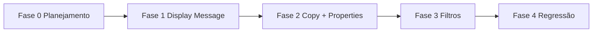

# Melhorias UX CLEF Viewer — Tasks

Última atualização: 2026-06-26

**Base:** [requirements.md](requirements.md) · [design.md](design.md) · [CONTEXT.md](../../CONTEXT.md)

Legenda: ✅ concluído · 🔄 em progresso · ⏳ pendente · 🚫 cancelado

---

## Fase 0 — Planejamento

| ID | Task | Status | Evidência |
|----|------|--------|-----------|
| U00 | Requisitos EARS + grilling | ✅ | [requirements.md](requirements.md) |
| U01 | Design técnico | ✅ | [design.md](design.md) |
| U02 | Tasks de implementação | ✅ | Este arquivo |

---

## Fase 1 — PR1: Display Message

| ID | Task | Status | Arquivos / notas |
|----|------|--------|------------------|
| U10 | `MessageTemplateRenderer` — placeholders `{name}`, dotted keys, `{{escape}}`, missing/null | ⏳ | `lib/utils/message_template_renderer.dart` |
| U11 | Testes unitários do renderer | ⏳ | `test/message_template_renderer_test.dart` |
| U12 | `DisplayMessageText` — `@m` plano; template com `Text.rich` + estilos tema | ⏳ | `lib/widgets/display_message_text.dart` |
| U13 | Testes widget `DisplayMessageText` (substituted, missing, plain `@m`) | ⏳ | `test/display_message_text_test.dart` |
| U14 | Integrar `DisplayMessageText` em `LogRow` (substituir `Text(displayMessage)`) | ⏳ | `lib/widgets/log_row.dart` |
| U15 | Atualizar `log_table_test.dart` — esperar texto substituído, não template cru | ⏳ | `test/log_table_test.dart` |

**Critério de done PR1:** card colapsado/expandido exibe Display Message com valores destacados (`primary` + `w600`) e placeholders ausentes em vermelho tracejado.

---

## Fase 2 — PR2: Copiar log + Property chips

| ID | Task | Status | Arquivos / notas |
|----|------|--------|------------------|
| U20 | `LogCopyFormatter` — texto multi-linha legível | ⏳ | `lib/utils/log_copy_formatter.dart` |
| U21 | Testes unitários `LogCopyFormatter` | ⏳ | `test/log_copy_formatter_test.dart` |
| U22 | Botão copiar em `LogRow` — hover (colapsado) + sempre visível (expandido) | ⏳ | `Clipboard.setData` + SnackBar |
| U23 | `PropertyFilterHelper` — `isFilterable`, `toFilterParam`, sentinel | ⏳ | `lib/utils/property_filter_helper.dart` |
| U24 | Testes unitários `PropertyFilterHelper` | ⏳ | `test/property_filter_helper_test.dart` |
| U25 | `PropertyChip` — clicável só para primitivos | ⏳ | `lib/widgets/property_chip.dart` |
| U26 | Substituir bloco JSON em `LogRow` por `Wrap` de `PropertyChip` | ⏳ | `lib/widgets/log_row.dart` |
| U27 | `LogTable` + `ViewerPage` — wiring `onPropertyFilter` → `FilterBarState.applyPropertyFilter` | ⏳ | `log_table.dart`, `viewer_page.dart`, `filter_bar.dart` |
| U28 | Testes widget `PropertyChip` e `LogRow` (copy, expand) | ⏳ | `test/property_chip_test.dart`, `test/log_row_test.dart` |

**Critério de done PR2:** copiar log funciona sem expandir card; property primitiva aplica filtro imediato; Map/List visível mas não clicável.

---

## Fase 3 — PR3: Filtros (autocomplete + chips ativos)

| ID | Task | Status | Arquivos / notas |
|----|------|--------|------------------|
| U30 | `DeviceSuggestionCache` — group API (`LogFilter` vazio) + merge SSE | ⏳ | `lib/services/device_suggestion_cache.dart` |
| U31 | Testes unitários `DeviceSuggestionCache` (search, merge) | ⏳ | `test/device_suggestion_cache_test.dart` |
| U32 | `DeviceIdField` — `RawAutocomplete` + apply imediato + `(empty)` → sentinel | ⏳ | `lib/widgets/device_id_field.dart` |
| U33 | `ActiveFilterChipFactory` — deriva chips de `LogFilter` + remoção parcial | ⏳ | `lib/utils/active_filter_chip_factory.dart` |
| U34 | `ActiveFilterChips` widget | ⏳ | `lib/widgets/active_filter_chips.dart` |
| U35 | Refatorar `FilterBar` — remover `event_id`; integrar `DeviceIdField` + chips | ⏳ | `lib/widgets/filter_bar.dart` |
| U36 | `ViewerPage` — instanciar cache, `load()` no init, merge em `_onSseEvent` | ⏳ | `lib/pages/viewer_page.dart` |
| U37 | Testes widget `FilterBar` (sem Event ID, chips removíveis) + `ActiveFilterChips` | ⏳ | `test/filter_bar_test.dart`, `test/active_filter_chips_test.dart` |

**Critério de done PR3:** autocomplete lista devices do banco; seleção aplica filtro; chips ativos para levels/device/property/search removíveis com apply imediato; campo Event ID ausente.

---

## Fase 4 — PR4: Regressão e aceitação

| ID | Task | Status | Arquivos / notas |
|----|------|--------|------------------|
| U40 | `flutter test` verde em `apps/clef_viewer/ui` | ⏳ | CI local |
| U41 | `flutter analyze` sem warnings novos | ⏳ | `ui/analysis_options.yaml` |
| U42 | Checklist de aceitação manual (abaixo) | ⏳ | Browser Flutter Web |
| U43 | Atualizar `apps/clef_viewer/README.md` — novas interações UI | ⏳ | Opcional pós-merge |

---

## Dependências entre fases

| Task | Depende de |
|------|------------|
| U12–U14 | U10 |
| U22 | U20 |
| U27 | U25, U23 + stub `applyPropertyFilter` em FilterBar |
| U32–U36 | U30 |
| U35 | U32, U33, U34 |
| U40 | U11, U13, U15, U21, U24, U28, U31, U37 |

---

## Aceitação manual

Checklist pós-implementação (Developer / Operator):

### Display Message (R1)
- [ ] Log com `@mt` + properties mostra valores substituídos destacados (não `{name}` cru)
- [ ] Placeholder sem property aparece `{key}` com fundo vermelho/tracejado
- [ ] Log com `@m` exibe texto plano sem destaque
- [ ] Template `{{literal}}` exibe `{literal}` sem substituir

### Device autocomplete (R2)
- [ ] Campo Device ID sugere IDs ao digitar (case-insensitive)
- [ ] `(empty)` aparece nas sugestões quando há logs sem device
- [ ] Selecionar sugestão aplica filtro imediatamente (sem Apply)
- [ ] Novo device via SSE entra na lista de sugestões

### Copiar log (R3)
- [ ] Ícone copiar aparece no hover (card colapsado)
- [ ] Ícone copiar permanece visível com card expandido
- [ ] Copiar não expande/colapsa o card
- [ ] SnackBar "Copiado" após sucesso
- [ ] Texto colado inclui timestamp, level, mensagem, device, properties

### Filtro por property (R4)
- [ ] Chip `UserId: 42` aplica `property=UserId=42` imediatamente
- [ ] Chip com Map/List não responde a clique
- [ ] Segundo clique em outra property substitui filtro anterior

### UX geral (R5)
- [ ] Chips removíveis para levels, device, property, search
- [ ] Remover chip recarrega eventos imediatamente
- [ ] Campo Event ID ausente da FilterBar
- [ ] `from`/`to` não geram chips (só nos campos)

---

## Fora de escopo (não criar tasks)

- Endpoint novo `/api/events/devices`
- Cópia em formato CLEF JSON
- Parser Serilog completo (`{n:fmt}`)
- Filtro AND de múltiplas properties
- Dark mode dedicado

---

## Estimativa

| Fase | Tasks | Complexidade |
|------|-------|--------------|
| Fase 1 | U10–U15 | Média (parser + RichText) |
| Fase 2 | U20–U28 | Média |
| Fase 3 | U30–U37 | Média-alta (wiring FilterBar/ViewerPage) |
| Fase 4 | U40–U43 | Baixa |

**Total:** 28 tasks de implementação (U10–U43), 4 fases sequenciais.