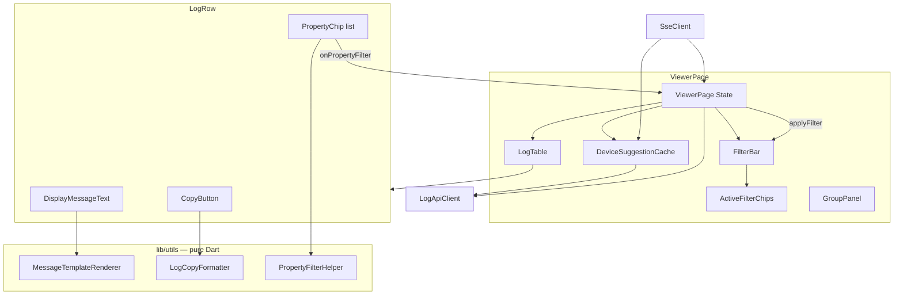
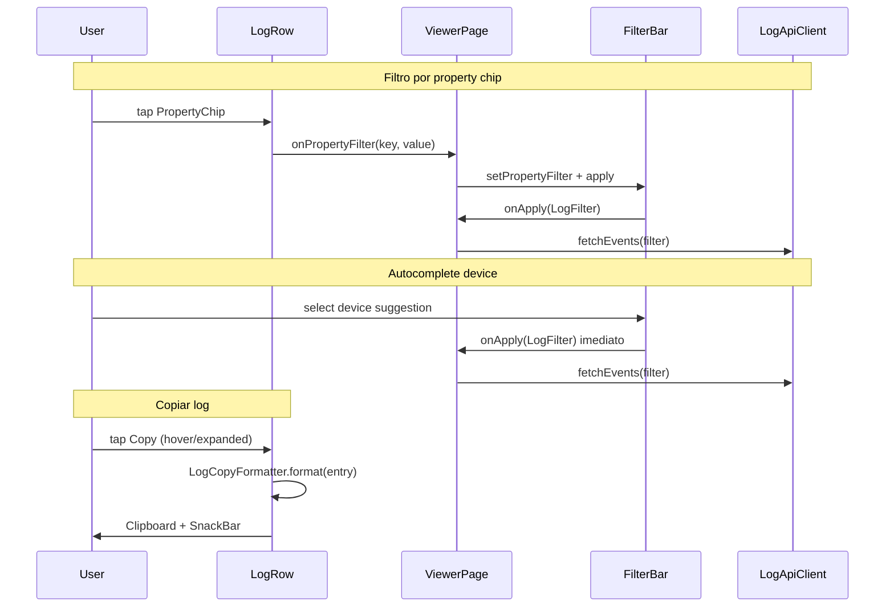
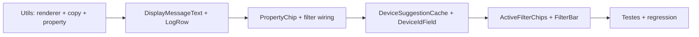

# Design Document: Melhorias de UX — CLEF Viewer UI

**Baseado em:** [requirements.md](requirements.md), [CONTEXT.md](../../CONTEXT.md)  
**Data:** 2026-06-26  
**Status:** Aprovado para implementação  
**Escopo:** `apps/clef_viewer/ui` apenas — sem alterações no servidor

---

## Overview

Melhorar a experiência de inspeção de logs na Flutter Web UI do CLEF Viewer com cinco capacidades: **Display Message** com destaque de propriedades, **autocomplete de Device ID**, **cópia de log**, **filtro por property chip**, e **indicadores de filtros ativos**. Toda a lógica nova roda no cliente; a API existente (`/api/events`, `/api/events/group`, SSE) permanece inalterada.

**Abordagem:** extrair utilitários puros (parser de template, formatação de cópia) testáveis sem widget; refatorar `LogRow` e `FilterBar` como composição de widgets menores; `ViewerPage` orquestra cache de devices e propaga filtros.

**Premissa confirmada:** `SinkSeq` envia `@mt` sem `@m` — Display Message client-side é o caminho principal, não fallback.

---

## Requirements Traceability

| Req | Design Section |
|-----|----------------|
| R1 — Display Message | [MessageTemplateRenderer](#messagetemplaterenderer), [DisplayMessageText](#displaymessagetext) |
| R2 — Autocomplete Device ID | [DeviceSuggestionCache](#devicesuggestioncache), [DeviceIdField](#deviceidfield) |
| R3 — Copiar log | [LogCopyFormatter](#logcopyformatter), [LogRow actions](#logrow-refatorado) |
| R4 — Filtro por property | [PropertyChip](#propertychip), [PropertyFilterHelper](#propertyfilterhelper) |
| R5 — UX geral | [ActiveFilterChips](#activefilterchips), [FilterBar refatorada](#filterbar-refatorada) |
| NFR — Performance | [Performance Considerations](#performance-considerations) |
| NFR — Acessibilidade | [Accessibility](#accessibility) |

---

## Research Findings

### SinkSeq / CLEF payload

**Sources:** [`sink_seq.dart`](../../lib/src/log_sinks/sink_seq.dart), [CONTEXT.md](../../CONTEXT.md)

**Key Insights:**
- Payload CLEF inclui `@mt`, `@l`, `@t`, `DeviceIdentifier` e properties flat no topo do JSON
- `@m` (Rendered Message) não é enviado pelo `SinkSeq`
- Properties usam chaves flat, inclusive dotted (`Source.Context`)

**Impact on Design:** Parser de template roda sempre no cliente; `@m` é branch secundário (texto plano).

### Group API para devices

**Sources:** [`log_repository.dart`](../../apps/clef_viewer/server/lib/db/log_repository.dart), [`log_api_client.dart`](../../apps/clef_viewer/ui/lib/services/log_api_client.dart)

**Key Insights:**
- `GET /api/events/group?group_by=device_id` retorna `{groups: [{key, count}]}` com limite 100
- Chave vazia retorna como `(empty)` via `COALESCE(device_id, '(empty)')`
- Query aceita filtros via query params; autocomplete usa `LogFilter()` vazio

**Impact on Design:** Sem endpoint novo; `DeviceSuggestionCache` chama `fetchGroups` uma vez no load e faz merge com SSE.

### Flutter Web clipboard

**Sources:** [Flutter Clipboard API](https://api.flutter.dev/flutter/services/Clipboard-class.html)

**Key Insights:**
- `Clipboard.setData(ClipboardData(text: ...))` funciona em Flutter Web
- Pode falhar em contextos sem permissão — tratar com try/catch + SnackBar

**Impact on Design:** `LogCopyFormatter` + `Clipboard.setData`; sem dependência extra.

---

## Architecture

### System Overview



### Component Architecture

| Camada | Artefato | Responsabilidade |
|--------|----------|------------------|
| **Utils** | `MessageTemplateRenderer` | `@mt` + properties → segmentos tipados para RichText |
| **Utils** | `LogCopyFormatter` | `LogEntry` → texto multi-linha para clipboard |
| **Utils** | `PropertyFilterHelper` | Valor primitivo → string `chave=valor`; detecta filtrável |
| **Widget** | `DisplayMessageText` | Renderiza segmentos com estilos do tema |
| **Widget** | `PropertyChip` | Chip de property; clicável só se primitivo |
| **Widget** | `ActiveFilterChips` | Chips removíveis derivados de `LogFilter` |
| **Widget** | `DeviceIdField` | `Autocomplete` + apply imediato |
| **Service** | `DeviceSuggestionCache` | Cache de devices (group API + merge SSE) |
| **Page** | `ViewerPage` | Orquestra cache, filtros, callbacks entre componentes |
| **Widget** | `LogRow` | Card composto: header, Display Message, properties, copy |
| **Widget** | `FilterBar` | Campos de filtro sem `event_id`; delega chips e autocomplete |

### Data Flow



### Technology Decisions

| Decisão | Escolha | Rationale |
|---------|---------|-----------|
| Parser Serilog | Básico (`{name}` + `{{literal}}`) | Alinhado ao grilling #13; `SinkSeq` não usa formatos `{n:fmt}` |
| Device suggestions | Group API existente | Zero mudança no servidor (grilling #6–7) |
| Autocomplete widget | `RawAutocomplete<String>` | Nativo Flutter; sem dependência extra |
| Rich text | `Text.rich` + `TextSpan` | Performance adequada para 100 cards; sem pacote externo |
| State de hover | `MouseRegion` em `LogRow` | Padrão Flutter Web para affordances |

---

## Components and Interfaces

### MessageTemplateRenderer

**Purpose:** Converter Message Template + properties em segmentos para Display Message.

**Responsibilities:**
- Resolver placeholders `{Key}` contra `properties['Key']` (flat, incluindo dotted)
- Tratar `{{literal}}` como escape → output `{literal}`
- Classificar segmentos: `plain`, `substituted`, `missing`
- Formatar valores primitivos como string legível

**Interface:**

```dart
enum DisplaySegmentKind { plain, substituted, missing }

class DisplayMessageSegment {
  final String text;
  final DisplaySegmentKind kind;
  const DisplayMessageSegment(this.text, this.kind);
}

class MessageTemplateRenderer {
  /// Retorna null se não há template (caller usa fallback).
  static List<DisplayMessageSegment>? renderTemplate(
    String template,
    Map<String, dynamic> properties,
  );

  /// Texto plano sem estilos — para cópia e testes.
  static String renderPlain(String template, Map<String, dynamic> properties);

  static String formatPropertyValue(dynamic value);
}
```

**Algorithm (tokenização linear):**

```
i = 0
while i < template.length:
  if template[i..i+1] == "{{":
    find closing "}}"
    emit plain segment "{literal}"  // conteúdo entre {{ }}
    continue
  if template[i] == "{":
    match /^\{([A-Za-z_][A-Za-z0-9_.-]*)\}/
    if key in properties && value != null:
      emit substituted segment formatPropertyValue(value)
    else:
      emit missing segment "{key}"
    continue
  accumulate plain text until next "{" or end
```

**`formatPropertyValue` rules:**

| Tipo | Output |
|------|--------|
| `String` | valor direto |
| `num`, `bool` | `toString()` |
| `null` | tratado como missing (segmento `{key}`) |
| `Map`, `List` | `jsonEncode` compacto (só exibição; chip não filtra) |

**Dependencies:** `dart:convert` para JSON compacto em valores objeto exibidos no template.

---

### DisplayMessageText

**Purpose:** Widget que renderiza Display Message com estilos do tema.

**Responsibilities:**
- Se `renderedMessage != null` → `Text` plano
- Senão se `messageTemplate != null` → `Text.rich` com segmentos do renderer
- Senão → fallback `exception ?? '(no message)'`

**Interfaces:**

```dart
class DisplayMessageText extends StatelessWidget {
  final LogEntry entry;
  final int? maxLines;
  final TextOverflow? overflow;

  const DisplayMessageText({
    required this.entry,
    this.maxLines,
    this.overflow,
  });
}
```

**Style mapping:**

| `DisplaySegmentKind` | Style |
|---------------------|-------|
| `plain` | `Theme.textTheme.bodyMedium` default |
| `substituted` | `color: colorScheme.primary`, `fontWeight: w600` |
| `missing` | `color: colorScheme.error` com `Decoration: BoxDecoration(color: error.withOpacity(0.1), border: Border.all(color: error, style: dashed))` via `WidgetSpan` com `Container` |

> **Nota:** `missing` usa `WidgetSpan` (pequeno `Container` inline) para fundo vermelho + borda tracejada (grilling #10). Alternativa aceitável: `TextSpan` com `backgroundColor` se tracejado não for viável inline — preferir `WidgetSpan` no implement.

---

### LogCopyFormatter

**Purpose:** Formatar Log Event para clipboard em texto legível.

**Interface:**

```dart
class LogCopyFormatter {
  static String format(LogEntry entry);
}
```

**Output format:**

```
{timestamp} [{level}] {displayMessagePlain}
device: {deviceId}          // omitir linha se null/empty
exception:                   // omitir se null
{exception multiline}
properties: {json compact}
```

`displayMessagePlain` usa `renderedMessage ?? MessageTemplateRenderer.renderPlain(...) ?? template ?? exception`.

---

### PropertyFilterHelper

**Purpose:** Construir Property Filter e determinar se valor é filtrável.

**Interface:**

```dart
class PropertyFilterHelper {
  static bool isFilterable(dynamic value);

  /// Retorna "Key=value" ou "Key=__empty__" para null.
  static String toFilterParam(String key, dynamic value);

  static String displayValue(dynamic value); // para label do chip
}
```

**`isFilterable`:** `true` para `String`, `num`, `bool`; `false` para `Map`, `List`, outros.

**`toFilterParam`:** `null` → `FilterConstants.emptySentinel`; primitivos → `toString()`; não chamar para não-filtráveis.

---

### PropertyChip

**Purpose:** Exibir par chave-valor; aplicar filtro em clique único.

**Interface:**

```dart
class PropertyChip extends StatelessWidget {
  final String propertyKey;
  final dynamic value;
  final ValueChanged<String> onFilter; // recebe "Key=value" completo

  const PropertyChip({...});
}
```

**Behavior:**
- Label: `$key: ${PropertyFilterHelper.displayValue(value)}`
- `onTap`: se `isFilterable(value)` → `onFilter(toFilterParam(...))`; senão → sem ação
- Visual: `ActionChip` ou `InputChip` com `onPressed: null` + opacidade reduzida quando não filtrável
- `tooltip`: "Filtrar por $key" ou "Valor complexo — não filtrável"

---

### DeviceSuggestionCache

**Purpose:** Manter lista de Device Identifiers para autocomplete.

**Interface:**

```dart
class DeviceSuggestionCache {
  DeviceSuggestionCache({required LogApiClient api});

  List<String> get suggestions;
  bool get isLoaded;

  Future<void> load(); // fetchGroups(device_id, LogFilter())
  void mergeFromEvent(LogEntry entry); // SSE: add if new
  List<String> search(String query);   // case-insensitive substring, max 50
}
```

**`(empty)` handling:** quando group retorna key `(empty)`, mapear para label `(empty)`; ao aplicar filtro, `ViewerPage` converte para `FilterConstants.emptySentinel` em `deviceId`.

**Lifecycle:** `ViewerPage.initState` → `load()`; cada `_onSseEvent` → `mergeFromEvent(entry)`.

---

### DeviceIdField

**Purpose:** Campo Device ID com autocomplete e apply imediato.

**Interface:**

```dart
class DeviceIdField extends StatelessWidget {
  final TextEditingController controller;
  final DeviceSuggestionCache cache;
  final ValueChanged<String?> onDeviceSelected; // device id ou sentinel

  const DeviceIdField({...});
}
```

**Implementation:** `RawAutocomplete<String>` com `optionsBuilder` chamando `cache.search(textEditingValue.text)`.

**onSelected:**
1. Se selection == `(empty)` → callback com `FilterConstants.emptySentinel`
2. Senão → callback com device id
3. `ViewerPage` monta `LogFilter.copyWith(deviceId: ...)` e aplica

---

### ActiveFilterChips

**Purpose:** Exibir e remover filtros ativos.

**Interface:**

```dart
class ActiveFilterChipData {
  final String id;       // ex: "level:error", "device:my-app"
  final String label;    // ex: "level: error", "device: my-app"
  final VoidCallback onRemove;
}

class ActiveFilterChips extends StatelessWidget {
  final List<ActiveFilterChipData> chips;
  const ActiveFilterChips({required this.chips});
}
```

**Chip derivation from `LogFilter`:**

| Campo ativo | Chip(s) |
|-------------|---------|
| `levels` | Um chip por level: `level: {name}` |
| `deviceId` | `device: {id}` ou `device: (empty)` se sentinel |
| `property` | `property: {k=v}` literal |
| `search` | `search: {query}` |
| `from`, `to`, `eventId` | **Sem chip** (eventId removido da UI) |

**onRemove:** muta cópia local do filtro (remove critério) → `onApply` imediato.

Factory helper:

```dart
class ActiveFilterChipFactory {
  static List<ActiveFilterChipData> fromFilter(
    LogFilter filter,
    void Function(LogFilter updated) onApply,
  );
}
```

---

### FilterBar (refatorada)

**Changes:**
- Remover `_eventIdController` e campo Event ID
- Substituir `TextField` de Device ID por `DeviceIdField`
- Adicionar `ActiveFilterChips` abaixo dos campos
- Expor método público `applyPropertyFilter(String propertyParam)` via `FilterBarState` para `ViewerPage` acionar após chip click no log

**Interface additions:**

```dart
class FilterBarState extends State<FilterBar> {
  void applyExternalFilter(LogFilter filter) {
    _syncControllersFromFilter(filter);
    widget.onApply(filter);
  }

  void applyPropertyFilter(String propertyParam) {
    _propertyController.text = propertyParam;
    apply();
  }
}
```

**Apply semantics (grilling #5):**
- Campos editados manualmente → botão **Apply**
- Autocomplete device, property chip, remoção de active chip → apply imediato

---

### LogRow (refatorado)

**Changes:**
- `MouseRegion` + `_hovering` state para botão copiar
- Substituir `Text(displayMessage)` por `DisplayMessageText`
- Substituir JSON block por `Wrap` de `PropertyChip`
- Botão `IconButton(Icons.copy)` visível quando `_hovering || _expanded`
- `onTap` do `InkWell` não dispara quando tap vem do copy button (`IconButton` absorve)

**New callbacks:**

```dart
class LogRow extends StatefulWidget {
  final LogEntry entry;
  final ValueChanged<String>? onPropertyFilter; // "Key=value"

  const LogRow({...});
}
```

**Copy action:**

```dart
Future<void> _copyLog(BuildContext context) async {
  final text = LogCopyFormatter.format(widget.entry);
  try {
    await Clipboard.setData(ClipboardData(text: text));
    if (context.mounted) {
      ScaffoldMessenger.of(context).showSnackBar(
        const SnackBar(content: Text('Copiado'), duration: Duration(seconds: 2)),
      );
    }
  } catch (_) {
    if (context.mounted) {
      ScaffoldMessenger.of(context).showSnackBar(
        const SnackBar(content: Text('Falha ao copiar')),
      );
    }
  }
}
```

---

### ViewerPage (alterações)

**New state:**

```dart
late final DeviceSuggestionCache _deviceCache;
```

**Wiring:**

```dart
LogRow(
  entry: events[index],
  onPropertyFilter: (param) {
    _filterBarKey.currentState?.applyPropertyFilter(param);
  },
)

FilterBar(
  key: _filterBarKey,
  deviceCache: _deviceCache,
  ...
)

// Em _onSseEvent:
_deviceCache.mergeFromEvent(entry);
```

---

## Data Models

### DisplayMessageSegment

| Field | Type | Description |
|-------|------|-------------|
| `text` | `String` | Trecho de texto |
| `kind` | `DisplaySegmentKind` | Estilo a aplicar |

### ActiveFilterChipData

| Field | Type | Description |
|-------|------|-------------|
| `id` | `String` | Identificador único do chip |
| `label` | `String` | Texto exibido |
| `onRemove` | `VoidCallback` | Remove critério e reaplica |

### LogFilter (UI exposure)

| Field | UI exposto | Chip | Autocomplete |
|-------|------------|------|--------------|
| `from` | Sim (campo) | Não | — |
| `to` | Sim (campo) | Não | — |
| `levels` | Sim | Sim (um por level) | — |
| `deviceId` | Sim | Sim | Sim |
| `property` | Sim | Sim | — |
| `search` | Sim | Sim | — |
| `eventId` | **Removido** | — | — |

> `eventId` permanece no model e `LogFilter.matches` para compatibilidade SSE, mas sem campo na FilterBar.

---

## File Plan

### Novos arquivos

| Arquivo | Tipo |
|---------|------|
| `lib/utils/message_template_renderer.dart` | Util |
| `lib/utils/log_copy_formatter.dart` | Util |
| `lib/utils/property_filter_helper.dart` | Util |
| `lib/utils/active_filter_chip_factory.dart` | Util |
| `lib/widgets/display_message_text.dart` | Widget |
| `lib/widgets/property_chip.dart` | Widget |
| `lib/widgets/active_filter_chips.dart` | Widget |
| `lib/widgets/device_id_field.dart` | Widget |
| `lib/services/device_suggestion_cache.dart` | Service |

### Arquivos modificados

| Arquivo | Mudança |
|---------|---------|
| `lib/widgets/log_row.dart` | Display Message, chips, copy, hover |
| `lib/widgets/filter_bar.dart` | Remove event_id, autocomplete, active chips |
| `lib/widgets/log_table.dart` | Passa `onPropertyFilter` para `LogRow` |
| `lib/pages/viewer_page.dart` | Device cache, wiring |
| `lib/models/log_entry.dart` | Deprecar `displayMessage` em favor de utils (opcional) |

### Testes novos

| Arquivo | Cobertura |
|---------|-----------|
| `test/message_template_renderer_test.dart` | Parser, escape, missing, dotted keys |
| `test/log_copy_formatter_test.dart` | Formato multi-linha |
| `test/property_filter_helper_test.dart` | isFilterable, sentinel |
| `test/display_message_text_test.dart` | Widget: substituted/missing/plain |
| `test/property_chip_test.dart` | Tap filtrável vs não-filtrável |
| `test/active_filter_chips_test.dart` | Remove chip → callback |
| `test/device_suggestion_cache_test.dart` | search, merge SSE |
| `test/log_row_test.dart` | Copy, expand, hover |
| `test/filter_bar_test.dart` | Sem event_id, chips, validation |

---

## Error Handling

| Cenário | Resposta UI | Ação |
|---------|-------------|------|
| Group API falha no load de devices | Campo texto livre funciona | Log silencioso; `suggestions = []` |
| Clipboard negado | SnackBar "Falha ao copiar" | Não propagar exceção |
| Property key inválida (regex) | Não aplicar filtro | SnackBar com mensagem do `LogFilter.validate` se houver |
| Template malformado (`{` sem `}`) | Tratar `{` como plain text | Parser defensivo, sem throw |
| SSE device merge em lista cheia (>100) | Manter top 100 do group; merge só adiciona se <100 ou substitui LRU local | Documentar limitação |

### Recovery

- **Device cache:** retry no próximo `ViewerPage` load ou refresh manual (futuro: botão refresh na FilterBar)
- **Copy:** usuário pode selecionar texto manualmente se clipboard falhar

---

## Performance Considerations

| Área | Estratégia | Target |
|------|------------|--------|
| Display Message parse | Computar por `LogRow`; resultado cacheável em `StatefulWidget` se profiling indicar | < 16ms/frame em scroll de 100 itens |
| `Text.rich` com `WidgetSpan` | Limitar `WidgetSpan` a segmentos `missing` (raros) | Maioria `TextSpan` leve |
| Device autocomplete | Cache em memória; `search()` O(n) com n ≤ 100 | < 300ms percebido (instantâneo local) |
| Active filter chips | Rebuild só de `FilterBar` subtree | Negligível |

**Otimização opcional (não MVP):** memoizar `MessageTemplateRenderer.renderTemplate` por `(template, properties hash)` com `Map` LRU no `LogRow` state.

---

## Accessibility

| Elemento | Semantics / Tooltip |
|----------|---------------------|
| Copy button | `tooltip: 'Copiar log'`, `Semantics(label: 'Copiar log')` |
| Property chip filtrável | `tooltip: 'Filtrar por {key}'` |
| Property chip não-filtrável | `tooltip: 'Valor complexo — não filtrável'` |
| Active filter chip | `Semantics(label: 'Remover filtro {label}')` |
| Missing placeholder | Cor + borda (não depender só de cor); texto `{key}` mantém significado |

---

## Testing Strategy

### Unit tests (utils)

- `MessageTemplateRenderer`: substituição simples, dotted key, `{{escape}}`, missing, null value, objeto em template
- `LogCopyFormatter`: todas as linhas presentes/ausentes
- `PropertyFilterHelper`: primitivos, complexos, empty sentinel
- `ActiveFilterChipFactory`: derivação e remoção parcial de `LogFilter`

### Widget tests

- `DisplayMessageText`: encontra `TextSpan` com texto substituído; missing com decoração
- `PropertyChip`: `onFilter` chamado só para string/number/bool
- `LogRow`: copy não expande card; ícone visível quando expanded
- `FilterBar`: sem widget `Event ID`; chip removível dispara `onApply`
- `DeviceIdField`: selecionar opção dispara callback

### Regression

- `log_table_test.dart`: atualizar — não esperar `Hello {name}` cru; esperar `Hello Alice` ou texto substituído
- `filter_bar_test.dart`: manter teste de validação from/to

### Manual (Flutter Web)

- Hover copy em desktop browser
- Autocomplete com lista > 20 devices
- Clicar property chip com valor `42` (number) filtra corretamente
- Remover chip `level: error` restaura lista

---

## Key Decisions

### Decision: Display Message client-side

**Context:** `SinkSeq` não envia `@m`.

**Decision:** Parser no cliente; `@m` exibido como texto plano quando presente.

**Rationale:** Caso principal do ecossistema; evita mudança no servidor.

**Implications:** `MessageTemplateRenderer` é componente crítico; cobertura de testes obrigatória.

---

### Decision: Group API para device autocomplete

**Context:** Evitar novo endpoint.

**Decision:** `fetchGroups(group_by: device_id)` com filtro vazio.

**Rationale:** Já implementado, testado, retorna `(empty)`.

**Implications:** Limite 100 devices; merge SSE para novos.

---

### Decision: Property chips — primitivos only

**Context:** Filtro server usa igualdade exata em `CAST(json_extract AS TEXT)`.

**Decision:** Map/List exibidos mas não clicáveis.

**Rationale:** Igualdade JSON frágil; caso raro no debug.

---

### Decision: Remover event_id da FilterBar

**Context:** Grilling #9 — simplificar UX.

**Decision:** Campo removido da UI; model mantido.

**Rationale:** Filtro pouco usado no fluxo diário; API server intacta.

---

## Implementation Order



1. **PR1 — Display Message:** utils + `DisplayMessageText` + `LogRow` header
2. **PR2 — Copy + Properties:** `LogCopyFormatter` + copy button + `PropertyChip`
3. **PR3 — Filtros:** `DeviceSuggestionCache`, `DeviceIdField`, `ActiveFilterChips`, remove event_id
4. **PR4 — Testes:** cobertura completa + atualizar testes existentes

---

## Quality Checklist

**Completeness:**
- [x] Todos os requisitos R1–R5 endereçados
- [x] Componentes e interfaces definidos
- [x] Modelos de dados documentados
- [x] Error handling coberto
- [x] Estratégia de testes por camada

**Clarity:**
- [x] Decisões de grilling refletidas
- [x] Diagramas de arquitetura e fluxo
- [x] Plano de arquivos explícito

**Feasibility:**
- [x] Sem mudanças no servidor
- [x] Sem dependências novas no `pubspec.yaml`
- [x] Compatível com Flutter Web existente

**Traceability:**
- [x] Tabela req → seção
- [x] Terminologia alinhada a `CONTEXT.md`

---

## Next Steps

1. Revisão e aprovação deste design
2. Quebrar em tasks (`TASKS.md`) seguindo [Implementation Order](#implementation-order)
3. Implementar PR1–PR4 em `apps/clef_viewer/ui`